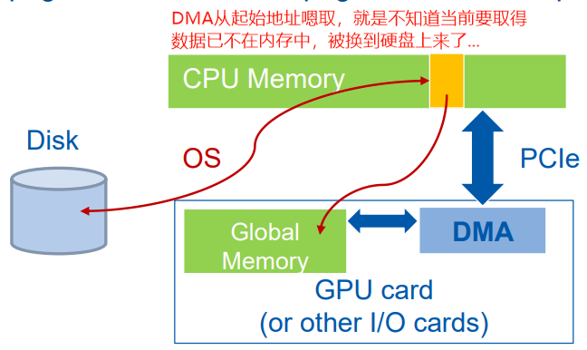
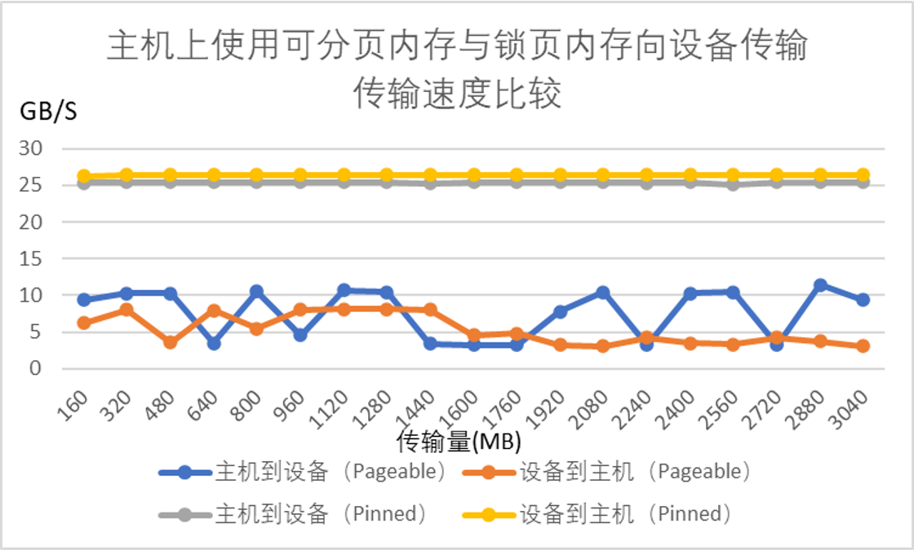

我们时常看到这种说明：为了加快主机和设备端的传输速度，我们一定要分配锁页内存(Pinned Memory)！但这是为啥呢？究竟能有多大的差距呢？

## 原理解释

> Ref：[How to Optimize Data Transfers in CUDA C/C++ | NVIDIA Technical Blog](https://developer.nvidia.com/blog/how-optimize-data-transfers-cuda-cc/)
>
> Ref：[Efficient Host-Device Data Transfers](https://eva.fing.edu.uy/pluginfile.php/261323/mod_resource/content/1/7-Efficient_Host_Device_Data_Transfers.pdf)

Host (CPU) data allocations are pageable by default. The GPU cannot access data directly from pageable host memory, so when a data transfer from pageable host memory to device memory is invoked, the CUDA driver must first allocate a temporary page-locked, or “pinned”, host array, copy the host data to the pinned array, and then transfer the data from the pinned array to device memory, as illustrated below.

> 主机上默认使用分页机制来管理内存，**但是GPU不能够直接访问可分页内存（Why?）**；若要将数据从可分页内存传到设备上去，必须**再另开一份锁页内存，先将数据从可分页内存拷贝到锁页内存上，然后再从锁页内存拷贝到设备上**。这就造成了传输开销。

As you can see in the figure, pinned memory is used as a staging area for transfers from the device to the host. We can avoid the cost of the transfer between pageable and pinned host arrays by directly allocating our host arrays in pinned memory. Allocate pinned host memory in CUDA C/C++ using [cudaMallocHost()](http://docs.nvidia.com/cuda/cuda-runtime-api/index.html#group__CUDART__MEMORY_1g9f93d9600f4504e0d637ceb43c91ebad) or [cudaHostAlloc()](http://docs.nvidia.com/cuda/cuda-runtime-api/index.html#group__CUDART__MEMORY_1g15a3871f15f8c38f5b7190946845758c), and deallocate it with [cudaFreeHost()](http://docs.nvidia.com/cuda/cuda-runtime-api/index.html#group__CUDART__MEMORY_1gedaeb2708ad3f74d5b417ee1874ec84a). It is possible for pinned memory allocation to fail, so you should always check for errors. The following code excerpt demonstrates allocation of pinned memory with error checking.

> 为了避免从可分页内存到锁页内存复制的开销，可以直接使用`cudaMallocHost()`分配锁页内存。

```
cudaError_t status = cudaMallocHost((void**)&h_aPinned, bytes);
if (status != cudaSuccess)
  printf("Error allocating pinned host memory\n");
```

Data transfers using host pinned memory use the same [cudaMemcpy()](http://docs.nvidia.com/cuda/cuda-runtime-api/index.html#group__CUDART__MEMORY_1g48efa06b81cc031b2aa6fdc2e9930741) syntax as transfers with pageable memory. We can use the following “bandwidthtest” program ([also available on Github](https://github.com/parallel-forall/code-samples/blob/master/series/cuda-cpp/optimize-data-transfers/bandwidthtest.cu)，在本文下面也列出来了) to compare pageable and pinned transfer rates.


等等，还有一个问题，那就是为啥**“GPU不能够直接访问可分页内存”**？

我们知道，现代计算机操作系统通常使用虚拟内存机制，以页为粒度来管理物理内存。由于物理内存大小有限，在实际使用过程中，可能会将物理内存中的页换出到磁盘（然后在物理内存同一位置换入新的页）。

而`cudaMemcpy`使用DMA来进行主机到设备拷贝的过程。DMA需要两端均提供物理地址，所以在最开始传输时，操作系统会将虚拟地址转换为物理地址、检查页是不是在物理内存上；一旦开始传输，操作系统就撒手不管了，DMA直接从给的物理地址开始嗯取。

如果参与传输的是可分页内存，那么就有可能：在DMA传输过程中，将要被传输的部分页被替换出去（同一位置又被换上来新的数据），物理内存中存的不是想要的数据了！此时再取便会出现错误，但设备DMA意识不到呀！只是一个劲的闷头取数...

所以，在进行DMA传输时，必须要分配锁页内存。若是刚开始数据不在锁页内存里，那就得再开一份锁页内存，先将数据拷贝到锁页内存中，然后再做锁页内存和设备间的传输。




## 测试程序

```c++
//传闻使用Pinned Memory，主机和设备之间的传输速度会快很多，尊嘟假嘟？o.O？
//代码来自：https://developer.nvidia.com/blog/how-optimize-data-transfers-cuda-cc/


#include <stdio.h>
#include <assert.h>

// Convenience function for checking CUDA runtime API results
// can be wrapped around any runtime API call. No-op in release builds.
inline
cudaError_t checkCuda(cudaError_t result)
{
#if defined(DEBUG) || defined(_DEBUG)
  if (result != cudaSuccess) {
    fprintf(stderr, "CUDA Runtime Error: %s\n", 
            cudaGetErrorString(result));
    assert(result == cudaSuccess);
  }
#endif
  return result;
}

void profileCopies(float        *h_a, 
                   float        *h_b, 
                   float        *d, 
                   unsigned int  n,
                   char         *desc)
{
  printf("\n%s transfers\n", desc);

  unsigned int bytes = n * sizeof(float);

  // events for timing
  cudaEvent_t startEvent, stopEvent; 

  checkCuda( cudaEventCreate(&startEvent) );
  checkCuda( cudaEventCreate(&stopEvent) );

  checkCuda( cudaEventRecord(startEvent, 0) );
  checkCuda( cudaMemcpy(d, h_a, bytes, cudaMemcpyHostToDevice) );
  checkCuda( cudaEventRecord(stopEvent, 0) );
  checkCuda( cudaEventSynchronize(stopEvent) );

  float time;
  checkCuda( cudaEventElapsedTime(&time, startEvent, stopEvent) );
  printf("  Host to Device bandwidth (GB/s): %f\n", bytes * 1e-6 / time);

  checkCuda( cudaEventRecord(startEvent, 0) );
  checkCuda( cudaMemcpy(h_b, d, bytes, cudaMemcpyDeviceToHost) );
  checkCuda( cudaEventRecord(stopEvent, 0) );
  checkCuda( cudaEventSynchronize(stopEvent) );

  checkCuda( cudaEventElapsedTime(&time, startEvent, stopEvent) );
  printf("  Device to Host bandwidth (GB/s): %f\n", bytes * 1e-6 / time);

  for (int i = 0; i < n; ++i) {
    if (h_a[i] != h_b[i]) {
      printf("*** %s transfers failed ***\n", desc);
      break;
    }
  }

  // clean up events
  checkCuda( cudaEventDestroy(startEvent) );
  checkCuda( cudaEventDestroy(stopEvent) );
}

int main()
{
  unsigned int nElements = 400*1024*1024;
  const unsigned int bytes = nElements * sizeof(float);

  // host arrays
  float *h_aPageable, *h_bPageable;   
  float *h_aPinned, *h_bPinned;

  // device array
  float *d_a;

  // allocate and initialize
  h_aPageable = (float*)malloc(bytes);                    // host pageable
  h_bPageable = (float*)malloc(bytes);                    // host pageable
  checkCuda( cudaMallocHost((void**)&h_aPinned, bytes) ); // host pinned
  checkCuda( cudaMallocHost((void**)&h_bPinned, bytes) ); // host pinned
  checkCuda( cudaMalloc((void**)&d_a, bytes) );           // device

  for (int i = 0; i < nElements; ++i) h_aPageable[i] = i;      
  memcpy(h_aPinned, h_aPageable, bytes);
  memset(h_bPageable, 0, bytes);
  memset(h_bPinned, 0, bytes);

  // output device info and transfer size
  cudaDeviceProp prop;
  checkCuda( cudaGetDeviceProperties(&prop, 0) );

  printf("\nDevice: %s\n", prop.name);
  printf("Transfer size (MB): %d\n", bytes / (1024 * 1024));

  // perform copies and report bandwidth
  profileCopies(h_aPageable, h_bPageable, d_a, nElements, "Pageable");
  profileCopies(h_aPinned, h_bPinned, d_a, nElements, "Pinned");

  printf("n");

  // cleanup
  cudaFree(d_a);
  cudaFreeHost(h_aPinned);
  cudaFreeHost(h_bPinned);
  free(h_aPageable);
  free(h_bPageable);

  return 0;
}

```

### 测试结果

A6000：



数据：

```
传输大小（MB）	主机到设备速率（Pageable，GB/s）	设备到主机速率（Pageable，GB/s）	主机到设备速率（Pinned，GB/s）	设备到主机速率（Pinned，GB/s）
160	9.397998	6.2112	25.370084	26.351294
320	10.237061	8.065362	25.388572	26.378607
480	10.297892	3.556557	25.404749	26.38166
640	3.519184	7.960066	25.415711	26.393381
800	10.530062	5.476946	25.416795	26.396297
960	4.554909	7.996683	25.426188	26.394099
1120	10.65561	8.083191	25.430241	26.400582
1280	10.455708	8.086489	25.429626	26.400324
1440	3.385849	8.054316	25.255167	26.396152
1600	3.219104	4.594468	25.437526	26.401601
1760	3.233543	4.780096	25.438593	26.399775
1920	7.774535	3.227716	25.43731	26.401522
2080	10.474471	3.056002	25.434491	26.400279
2240	3.200917	4.235453	25.323379	26.393129
2400	10.272053	3.490299	25.43813	26.404371
2560	10.467113	3.300235	25.124258	26.404445
2720	3.226995	4.237237	25.441009	26.40283
2880	11.400692	3.76046	25.436035	26.398781
3040	9.360521	3.04364	25.436524	26.403049

```

