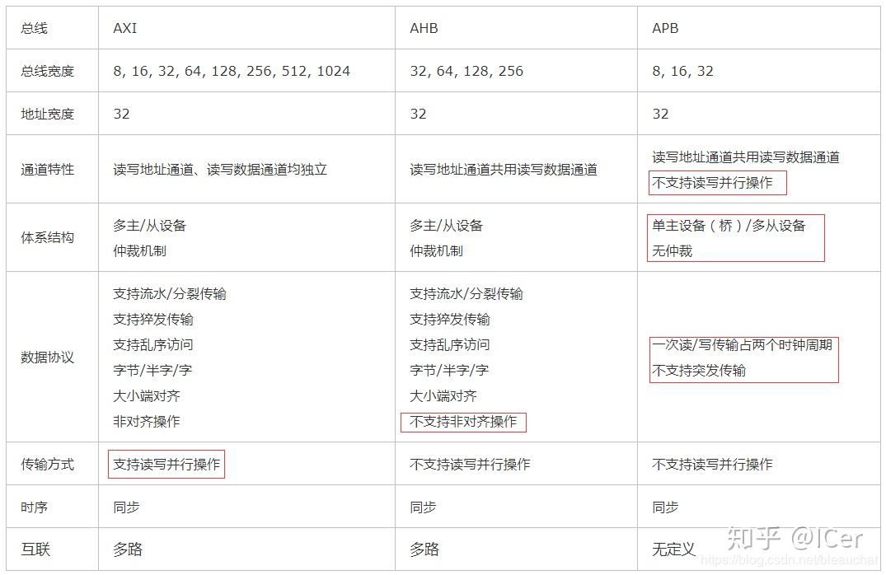

> 本文参考了如下链接，感谢原作者们的无私奉献：
>
> [在Xilinx FPGA上搭建SoC – 属于CYY自己的世界 (cyyself.name)](https://blog.cyyself.name/soc-on-xilinx-fpga/)
>
> [AMBA、AHB、APB、AXI总线介绍及对比 - 知乎 (zhihu.com)](https://zhuanlan.zhihu.com/p/161077476)
>
> 引用部分，均采用Markdown`>`语法标注。

# 基本概念

## 一些总线

> AHB主要是针对高效率、高频宽及快速系统模块所设计的总线，它可以连接如微处理器、芯片上或芯片外的内存模块和DMA等高效率模块；
>
> APB主要用在低速且低功率的外围，可针对外围设备作功率消耗及复杂接口的最佳化；APB在AHB和低带宽的外围设备之间提供了通信的桥梁，所以APB是AHB或ASB的二级拓展总线 ；
>
> AXI：高速度、高带宽，管道化互联，单向通道，只需要首地址，读写并行，支持乱序，支持非对齐操作，有效支持初始延迟较高的外设，连线非常多；

# 常见IP核

- AXI CrossBar：通常CPU只会引出一个AXI接口，如何挂接多个AXI设备呢？就需要加一个AXI CrossBar来实现
- Clocking Wizard：分频器
- Processor System Reset：只有当Clocking Wizard稳定下来后，方才解除其他设备的reset状态

# 串口

> AXI UART 16550 IP每个寄存器间隔4字节，龙芯杯资料包中的APB AXI+UART每个寄存器间隔1字节，运行Bootloader和操作系统需要注意设备树的修改。

# DDR

