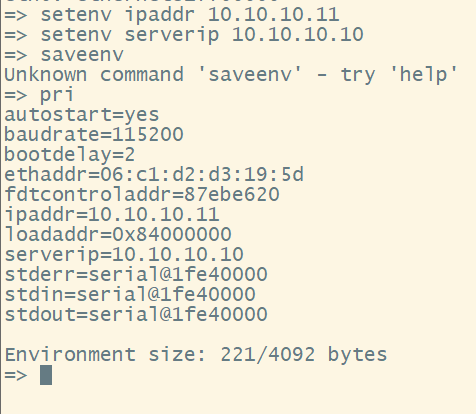

# 网络配置

> 自己的电脑IP设置为`10.10.10.10`，子网掩码`255.0.0.0`；

```
//设置ip地址
$ setenv ipaddr 10.10.10.11 
//设置tftp服务端ip地址(pc端地址)
$ setenv serverip 10.10.10.10
//查看当前设置,如下图所示
$ pri
```



# 通过tftp加载vmlinux

```
tftp vmlinux
bootelf
```

# 创建uImage

`vmlinux`是非压缩格式的镜像（`zImage`是压缩格式的），我们需要使用`u-boot`提供的`mkimage`工具，给`vmlinux`添加一些头，让`u-boot`能够识别。

首先安装`uboot-tools`工具（以`pacman`包管理器为例）：

```
sudo pacman -S uboot-tools
```

然后，使用`mkimage`制作`uImage`：

```
mkimage -A mips -O linux -T kernel -C none -a 0x800fffc0 -e 0x80100000 -n 'Linux-6.3' -d /home/geng/Item/linux/vmlinux uImage
```

其中，`-A` 指定CPU的体系结构、`-O` 指定操作系统类型、`-T` 指定映象类型、`-C` 指定映象压缩方式、`-a` 指定映象在内存中的加载地址、`-e` 指定映象运行的入口点地址，这个地址就是`-a`参数指定的值加上`0x40`（因为前面有个mkimage添加的0x40个字节的头）、`-n` 指定映象名、`-d` 指定制作映象的源文件、最后跟上一个最终生成的目标文件名。

关于`mkimage`命令的更多内容，可参考：[mkimage安装及其使用方法_XiaoCheng'Blog的博客-CSDN博客](https://blog.csdn.net/qq_44045338/article/details/109345192)
