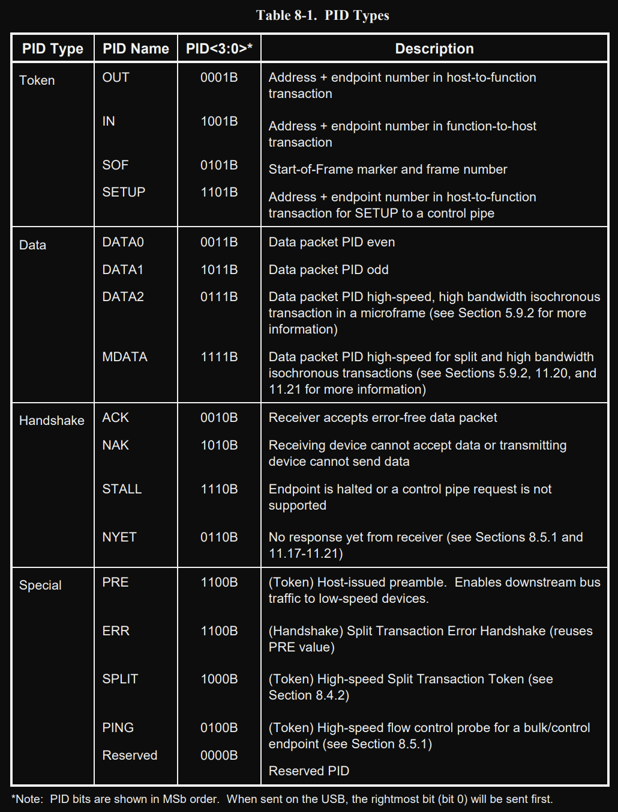

> 主要介绍几种数据包，本文大量参考了`hevry.jon at hotmail.com  `的USB2.0资料、FengJungle的USB2.0协议中文版，在此作出感谢！若侵权，请联系我删除。

# USB体系

一个 USB 系统中仅有一个 USB 主机；

设备包括 USB 功能设备和USB HUB，最多支持 127 个设备；

# USB四种类型传输

> 此处参考了`hevry.jon at hotmail.com  `的USB2.0资料，在此作出感谢！若侵权，请联系我删除。

**控制传输**：主要用于在设备连接时对设备进行**枚举**以及其他因设备而异的特定操作。

**中断传输**：用于对**延迟要求严格、小量数据**的可靠传输，如键盘、游戏手柄等。

> 注意：中断传输并不意味在传输过程中，设备会先中断 HOST，继而通知 HOST 启动传输。**中断传输也是 HOST 发起的传输**，采用**轮询的方式询问设备是否有数据发送**，若有则设备向主机传输数据，否则 NAK 主机  

**批量传输**：用于对**延迟要求宽松，大量数据**的可靠传输，如 U 盘等。 

**同步传输**：用于对**可靠性要求不高**的**实时**数据传输，如摄像头、USB 音响等。 

## 控制传输

> **控制传输**：主要用于在设备连接时对设备进行**枚举**以及其他因设备而异的特定操作。

控制传输是一种可靠的**双向**传输，一次控制传输可分为三个阶段。

- 第一阶段为**建立阶段**，从 HOST 到 Device 的 SETUP 事务传输，这个阶段指定了此次控制传输的请求类型；
- 第二阶段为**数据阶段**，也有些请求没有数据阶段；
- 第三阶段为**状态阶段**，通过一次IN/OUT 传输表明请求是否成功完成。  

> USB 采用**“令牌包” -“数据包” -“握手包”**的传输机制。控制传输的三个阶段，**每一个阶段都包括令牌包、数据包、握手包三部分**。

控制传输通过**控制管道**在应用软件和 Device 的控制端点之间进行，**控制传输过程中传输的数据是有格式定义的**， USB 设备或主机可根据格式定义解析获得的数据含义。**其他三种传输类型都没有格式定义**。  

控制传输对于**最大包长度**有固定的要求。对于高速设备该值为 64Byte；对于低速设备该值为 8；全速设备可以是 8 或 16 或 32 或 64。

> **最大包长度**表征了一个端点单次接收/发送数据的能力，实际上反应的是**该端点对应的Buffer的大小**。
>
> 当通过一个端点进行数据传输时，若**数据的大小超过该端点的最大包长度**时，**需要将数据拆分**成若干个数据包传输，并且要求**除最后一个包外**，**所有的包长度均等于该最大包长度**。这也就是说**如果一个端点收到/发送了一个长度小于最大包长度的包**，即意味着数据传输**结束**。  

## 中断传输

> **中断传输**：用于对**延迟要求严格、小量数据**的可靠传输，如键盘、游戏手柄等。

中断传输是一种**轮询**的传输方式，是一种**单向**的传输，HOST 通过固定的间隔对中断端点进行查询，若有数据传输或可以接收数据则返回数据或发送数据，否则返回 NAK，表示尚未准备好。

> 所谓单向传输，并不是说该传输只支持一个方向的传输，而是指在**某个端点上的传输仅支持一个方向**，或输出，或输入。如果**需要在两个方向上进行某种单向传输**，**需要占用两个端点**，分别配置成不同的方向，可以拥有相同的端点编号。

中断端点的**轮询间隔由在端点描述符中定义**，全速端点的轮询间隔可以是 1~255mS，低速端点为 10~255mS，高速端点为$(2^{interval-1})\times 125uS$，其中 interval 取 1 到 16 之间的值。

## 批量传输

> **批量传输**：用于对**延迟要求宽松，大量数据**的可靠传输，如 U 盘等。 

批量传输是一种**可靠的单向传输**，但**延迟没有保证**，它尽量利用可以利用的带宽来完成传输，适合数据量比较大的传输。

低速 USB 设备不支持批量传输，高速批量端点的最大包长度为 512，全速批量端点的最大包长度可以为 8、16、32、64。 批量传输在访问 USB 总线时，相对其他传输类型**具有最低的优先级**，USB  HOST 总是优先安排其他类型的传输，**当总线带宽有富余时才安排批量传输**。

高速的批量端点必须支持 PING 操作，向主机报告端点的状态，NYET 表示否定应答，没有准备好接收下一个数据包，ACK 表示肯定应答，已经准备好接收下一个数据包。

## 同步传输

> **同步传输**：用于对**可靠性要求不高**的**实时**数据传输，如摄像头、USB 音响等。 

同步传输是一种**实时的、不可靠**的传输，**不支持错误重发机制**。

# USB数据包

> 此处参考了`hevry.jon at hotmail.com  `的USB2.0资料，在此作出感谢！若侵权，请联系我删除。

USB 采用**轮询的广播机制**传输数据，**所有的传输都由主机发起**，任何时刻整个 USB 体系内**仅允许一个数据包的传输**，即不同物理传输线上看到的数据包都是同一被广播的数据包。

USB 采用**“令牌包” -“数据包” -“握手包”**的传输机制。

- **令牌包**：指定数据包去向或者来源的设备地址和端点（Endpoint），从而保证了只有一个设备对被广播的数据包/令牌包作出响应。  

- **数据包**：USB 总线上数据传输的最小单位，包括 **SYNC、数据及 EOP** 三个部分。其中数据的格式针对不同的包有不同的格式。但**都以 8 位的 PID 开始**。PID 指定了数据包的类型（共 16 种）。

  > 令牌包即指 PID 为 IN/OUT/SETUP 的包。  

- **握手包**：表示了传输的成功与否  

## USB数据包格式

> 这里的数据包包括上面的三种包：令牌包、数据包、握手包

USB 采用**小端法**字节序，在总线上先传输一个字节的最低有效位，最后传输最高有效位，采用 NRZI 编码，若遇到**连续的 6 个 1 要求进行为填充**，即**插入一个 0**。

所有的 USB 包**都由 SYNC 开始**，高速包的 SYNC 宽度为 32bit，全速/低速包的 SYNC 段度为 8bit。实际接收到的 SYNC 长度由于 USB HUB 的关系，可能会小于该值。

<table style="text-align: center;">
  <tr>
    <td rowspan="2">字段名</td>
    <td rowspan="2">PID</td>
    <td>ADDR</td>
    <td>ENDP</td>
    <td rowspan="2">DATA (数据包特有，令牌包、握手包没有)</td>
    <td rowspan="2">CRC</td>
  </tr>
  <tr>
    <td colspan="2">FrameNumber(令牌包特有，数据包、握手包没有)</td>
  </tr>
  <tr>
    <td rowspan="2">位数</td>
    <td rowspan="2">4+4D</td>
    <td>7</td>
    <td>4</td>
    <td rowspan="2">N*8(N=0,1,...,1024)</td>
    <td rowspan="2">5或16</td>
  </tr>
  <tr>
    <td colspan="2">11</td>
  </tr>
</table>

> - 令牌包有PID、ADDR、ENDP、CRC，没有DATA；
> - 数据包有PID、DATA、CRC，没有ADDR和ENDP；
> - 握手包只有PID。

- **PID**：由4位二进制（低4位）+4位校验码（高4位，对低4位的取反）表征了**数据包的类型**，分为令牌（Token）、数据（Data）、握手（Handshacke）以 及特殊包 4 大类，共 16 种类型的 PID。具体定义见英文协议第 196 页（见下图）。

  > 握手包包括 ACK，NAK，STALL 以及 NYET 四种，其中 ACK 表示肯定的应答，成功 的数据传输；NAK 表示否定的应答，失败的数据传输，要求重新传输；STALL 表示功能错 误或端点被设置了 STALL 属性；NYET 表示尚未准备好，要求等待。

  

  

数据在 USB 总线上的传输以**包**为单位，**包只能在帧内传输**。高速 USB 总线的帧周期为 125uS，全速以及低速 USB 总线的帧周期为 1mS。**帧的起始由一个特定的包（SOF 包）表示**，**帧尾为 EOF**。**EOF 不是一个包**，而是一种电平状态，EOF 期间不允许有数据传输。

## 控制传输

> 回忆：控制传输是**双向**的传输，必须有 IN 和 OUT 两个方向上的特定端点号的控制端点来完成两 个方向上的控制传输。

> 回忆：**每个阶段都有3个包**：令牌包、数据包、握手包

### 建立阶段

**<u>主机从 USB 设备</u>获取配置信息**，并设置设备的配置值。

建立阶段的数据交换**包含了 SETUP 令牌包、紧随其后的 DATA0 数据包以及 ACK 握手包**（SETUP 只能使用 DATA0 包， 8 字节）。它的作用是执行一个设置（概念含糊）的数据交换，并定义此控制传输的内容(即： 在 Data Stage 中 IN 或 OUT 的 data 包个数，及发送方向，在 Setup Stage 已经被设定)。

建立阶段**USB设备只能返回 ACK 包**，或者**不返回任何包**。

> - 建立阶段令牌包：主机-->USB设备
> - 建立阶段数据包：主机-->USB设备
> - 建立阶段握手包：USB设备-->主机

示例：

> 从上表中可以看到，ACK的PID是0010B，取反后为1101B。但文档中有这么一句话，“When sent on the USB, the rightmost bit (bit 0) will be sent first.”，再对应PID格式图，实际发出去的数据应该是 (这一位0先发-->)01001011，也就是0x4B啦！所以第三行握手包的ACK的PID写的是0x4B。

### 传输阶段

数据过程是可选的。一个数据过程包含一笔或者多笔数据事务。数据过程的**第一个数据包必须是 DATA1 包**，**然后**每次正确传输一个数据包就**在 DATA0 和 DATA1 之间交替**。

根据数据阶段的数据传输的方向，控制传输又可分为 3 种类型：**控制写入、控制读取、无数据控制**。

- **控制写入**（配置 USB 设备）： 是**将数据从主机传到设备上**，所传的数据即为对 USB 设备的**配置信息**。

  流程：①主机**先送出一个OUT令牌信息包**，**表示数据要送出去**；②紧接着，**主机将数据通过 DATA1/DATA0 数据信息包传递至设备**。③最后，**设备**将以下列方式加以**响应**：当数据已经**正确接收**时， 设备**送出 ACK 令牌信息包**；当设备**正在忙碌**时，设备**发出 NAK 握手信息包**；当发生了**错误**时，设备发出 **STALL 握手信息包**。

  > 令牌包：主机-->设备；数据包：主机-->设备；握手包：设备-->主机

- **控制读取**（读取 USB 描述符）： 是**将数据从设备读到主机上**，读取的数据是 USB 设备描述符。

  流程：①主机**先发送一个 IN 令牌信息包**，**表示要读数据进来**。②然后，**设备**将数据通过 DATA1/DATA0 数据信息包**回传给主机**。③最后，**主机**将以下列的方式加以**响应**：当数据已经正确接收时， 主机送出 ACK 令牌包；当主机正在忙碌时，发出 NAK 握手包；当发生了错误时，主 机发出 STALL 握手包。

  > 令牌包：主机-->设备；数据包：设备-->主机；握手包：主机-->设备

- **无数据控制**：略

示例：

### 状态阶段  

用来表示整个传输的过程已完全结束。**通过一次 IN/OUT 传输表明请求是否成功完成**。 状态阶段传输的方向必须**与数据阶段的方向相反**，即原来是 IN 令牌包，这个阶段应为 OUT 令牌包；反之，原来是 OUT 令牌包，这个阶段应为 IN 令牌包。

在状态阶段，对于控制读取（此前主机送出IN令牌包）而言，这时主机会送出 OUT 令牌包，其后，**主机**再发 0 长度的 DATA1 包，**设备**也会做出相对应的动作，送 ACK 握手包、NAK 握手包或 STALL 握手包。

在状态阶段，对于控制写入（此前主机送出OUT令牌包）而言，这时主机会送出 IN 令牌包，其后，**设备**再发 0 长度的 DATA1 包，**主机**也会做出相对应的动作，送 ACK 握手包、NAK 握手包或 STALL 握手包。

