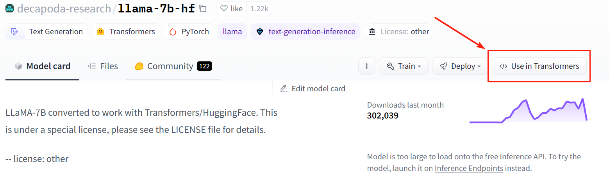
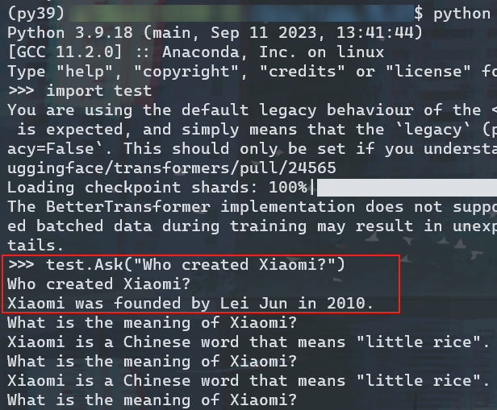

> 我导：跑个模型啊？
>
> 我：好的老师，收到。

本文主要依赖Huggingface提供的`transformers`库进行部署、推理。官方文档：[🤗 Transformers (huggingface.co)](https://huggingface.co/docs/transformers/v4.33.2/en/index)

## 下载模型

> 记得提前配置好网络，直接拉，拉不下来。2023.09.25

这里直接下载Llama-7B `hf`格式的模型：https://huggingface.co/decapoda-research/llama-7b-hf

> 1. `pip install huggingface_hub`
> 2. 注意更改`local_dir`参数

```python
from huggingface_hub import snapshot_download

snapshot_download(repo_id="decapoda-research/llama-7b-hf", ignore_patterns=["*.h5", "*.ot", "*.msgpack"], local_dir="/data/llama_7b", local_dir_use_symlinks=False)
```

然后，修改一下`tokenizer_config.json`，修改如下参数（否则报错，参考：[RecursionError: maximum recursion depth exceeded while getting the str of an object. · Issue #22762 · huggingface/transformers · GitHub](https://github.com/huggingface/transformers/issues/22762#issuecomment-1546774761)）

```
unk_token="<unk>"
bos_token="<s>"
eos_token="</s>"
```


## 配置推理环境

### 安装Transformers库

> 注意是`transformers`，比`transformer`多了一个`s`

参考：[Installation (huggingface.co)](https://huggingface.co/docs/transformers/v4.18.0/en/installation#cache-setup)

注意：文档中`Cache setup`很重要，决定了后续用Transformers库时，缓存的资源保存在何处。例如：我们服务器上单独挂了一个14T的盘到`/data`，那就设置一个环境变量（修改对应shell的`~/.某shrc`，并`source`一下，以应用到当前会话）

```shell
export TRANSFORMERS_CACHE=/data/XXX/transformers_cache
```

### 安装optimum库

推理要用到此库。

```shell
pip install optimum
```

### 使用pipeline进行推理

参考：[Pipelines for inference (huggingface.co)](https://huggingface.co/docs/transformers/v4.33.2/en/pipeline_tutorial)

参考：[Efficient Inference on a Multiple GPUs (huggingface.co)](https://huggingface.co/docs/transformers/perf_infer_gpu_many)

参考：[LLaMA (huggingface.co)](https://huggingface.co/docs/transformers/main/en/model_doc/llama)

> 突然发现Huggingface有个功能挺不错，要是基于Transformers模块做推理，可以点击右上角`User in Transformers`生成基本代码。

> 

然后自己写一下推理脚本：

```python
import torch
from transformers import AutoModelForCausalLM, AutoTokenizer
def Ask(text):
    input_text = text;
    inputs = tokenizer(input_text, return_tensors="pt").to("cuda")
    # with torch.backends.cuda.sdp_kernel(enable_flash=True, enable_math=False, enable_mem_efficient=False):
    generate_ids = model.generate(inputs.input_ids, max_length=100)
    print(tokenizer.batch_decode(generate_ids, skip_special_tokens=True, clean_up_tokenization_spaces=False)[0])

tokenizer = AutoTokenizer.from_pretrained("下下来模型的位置")
### ERROR - transformers.tokenization_utils -   Using pad_token, but it is not set yet
tokenizer.pad_token = tokenizer.eos_token
model = AutoModelForCausalLM.from_pretrained("下下来模型的位置").to("cuda")
# convert the model to BetterTransformer
model.to_bettertransformer()

```

## 进行推理！



有点憨憨的。
