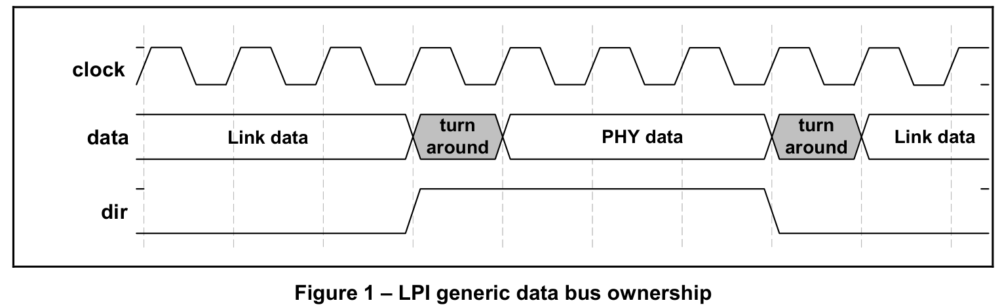

> ~~笔者近期要做ULPI 2 UTMI转换的模块~~，笔者近期要做UTMI的模块，故对学习过程进行记录。本文内容参考了UTMI、ULPI手册以及B站UP主叶倾城的视频。
>
> 希望能顺顺利利地完成相关工作！

# 概述

为什么要有USB PHY芯片？

有一些不带USB接口的处理芯片，比如FPGA。它们都不能直接处理USB总线上的DP、DM的差模信号。所以，芯片厂商开发了一些USB PHY芯片，可以把DP、DM上的差模信号转成共模信号。

USB PHY负责最底层的信号转换，作用类似于网口的PHY。

USB信号传输前，需要通过PHY把USB控制器的数字信号转成线缆上的模拟信号。USB控制器和PHY之间的总线主要有3种：种是ULPI，一种是UTMI+，还有一种是HSIC。

UTMI （USB2.0 Transceiver Macrocell Interface）是一种用于USB controller和USBPHY通信的协议。相对于ULPI,UTMI有更多的控制信号，支持8bit/16bit数据接口。

ULPI协议的全称是UTMI+ Low PinInterface，从名字上就可以看出ULPI是UTMI的LowPin版本。

# ULTI、UTMI、UTMI+

## UTMI与UMTI+

> The purpose of this document is to specify an interface to which USB 2.0 ASIC, ASSP, discrete PHY, system peripherals  and IP vendors can develop USB2.0 products. The existing UTMI specification describes an interface only for USB2.0  peripherals. The UTMI specification can not be used to develop USB 2.0 host or On-The-Go peripherals. The intention  of this UTMI+ specification is to extend the UTMI specification to standardize the interface for USB 2.0 hosts and USB  2.0 On-The-Go peripherals. The UTMI+ specification defines and standardizes the interoperability characteristics with  existing USB 2.0 hosts and peripherals.

个人理解：UMTI只是为USB 2.0外设立下了规矩，而没有考虑主机设备、OTG设备。UTMI+对UMTI进行拓展，加入了对主机设备、OTG设备的支持。

## UTLI与UTMI+

1. **线的数量**：ULPI的PIN少，UTMI+的PIN多。

   一般来说如果芯片的USB PHY封装在芯片内，基本采用UTMI+的接口。不封装到芯片内的一般采用ULPI接口，这样可以降低pin的数量。
   ULPI接口一共有12根信号线；UTMI+接口一共有24根、33根或大于33根信号线。
   显然，UTMI+接口的信号线太多，占用大量的PCB空间，才需要推出ULPI接口。市场上，大多数的USB PHY芯片都是ULPI接口。
   
2. **是否需要读写寄存器**：ULPI需要读写寄存器，而UTMI+只需直接拉高或拉低信号线。

ULPI是在UTMI+的基础上封装了一层。

# LPI接口简介（别看）

> 忽略它吧！阿门！反正现阶段是用不上看这一块了（悲）
>
> 看到一半才发现Xilinx提供的IP核，不能用来实现USB Host啊，TMD！

## 概述

LPI(Low Pin Interface)是一个通用的接口规范，可以理解ULPI为LPI的一个特例。

> ULPI和LPI接口并不完全一致。这里只是相当于来点开胃菜，以便于更好的理解ULPI

在介绍LPI接口前，需要考虑从谁的角度来介绍输入输出。考虑两端：PHY端和Link端

- PHY端：指USB PHY芯片
- Link端：指连到PHY芯片上的FPGA

## 信号

下文给出的信号表格，是从PHY的角度介绍的。

| 信号      | 信号方向 | 介绍                                                         |
| --------- | -------- | :----------------------------------------------------------- |
| **clock** | I/O      | **时钟信号**；可以输入，也可以输出；接口中的所有信号都要与**clock**同步。 |
| **data**  | I/O      | **数据信号**；双向数据总线，在空闲期间由 Link 驱动为低电平； Link和PHY使用非0模式串初始化数据传输； 通常是上升沿有效，也有上升、下降沿都有效的。 |
| **dir**   | OUT      | **方向**(Direction)；表示数据总线的方向（毕竟**data**是双向的信号么）； 当PHY用总线给Link传输数据， 或PHY不能接受来自Link的数据时（如时钟不稳），便拉高**dir**； 当PHY没有要传送的数据时，拉低**dir**，监听总线； |
| **stp**   | IN       | **停止**(Stop)；当Link端要停止当前在总线上的数据流时， 便将**stp**拉高一个时钟周期。 如果此时是Link在向PHY传输数据，**stp**拉高意味着**上一个周期**传输的是 最后一个字节； 如果此时是PHY在向Link传输数据，**stp**拉高后，PHY停止传输数据， 并且拉低**dir**，放弃对总线的控制。 |
| **nxt**   | OUT      | **下一个**(Next)；PHY设置这个信号，目的是为了节流(throttle)； 当PHY给Link发送数据时，**nxt**拉高意味着还有数据要发给link； 当Link给PHY发送数据时，**nxt**拉高意味着PHY已经接受这个周期的数据， Link下个周期可以接着发。 |

## 协议

### 总线所有权

正如前面介绍，总线所有权由**dir**信号控制，具体的时许关系见下图。

当**dir**拉高的时刻，**data**需要经历一个时钟周期，以切换总线所有权。

> 令我感到奇怪的是，`turn around`周期的上升沿，**dir**取什么值？是既不高，也不低，还是高呢？我个人理解是拉高。

### 传输数据

如下图所示：在前半段，首先Link通过总线发送非0数据；在传输完最后一个字节**后**，拉高了**stp**；

在后半段，我们看到**dir**只有在PHY给Link传输的时候拉高，其余时候都是低；

**nxt**和**stp**可能会在**同一个上升沿**被拉高。

### 终止数据

如果此时Link在给PHY发数据，那么PHY可以拉高**dir**来终止Link的数据传输；

如果此时PHY在给Link发数据，那么Link可以拉高一个周期的**stp**来使PHY拉低**dir**信号，中断PHY的数据传输。并不是在所有情况下拉高**stp**都会使得PHY拉低**dir**，譬如当PHY时钟不稳时，其不能接受来自PHY的数据，此时即便**stp**拉高了，**dir**也不会拉低。

# UTMI接口

> 看ULPI看到一半，发现Xilinx提供的IP核不支持实现USB Host、OTG，寄。
>
> 那么目前可行的方案便是去看UTMI的规范，把`ultraembedded`的开源IP核搞明白是怎么一回事。
>
> 此外，根据前面的叙述，UTMI主要是叙述外设端的，UTMI+方才描述了主机端如何进行处理。

## 简介

ASIC专用集成电路中的门阵列，其频率只能跑到30~60MHz；但USB 2.0信号通常能跑到几百MHz。如果不加修改的使用传统VHDL编程，可能会很难。

有了UTMI接口后，ASIC厂商将UTMI接口留出，USB外设和IP厂商实现UTMI接口便可，而无需关注USB 2.0的细节。

下图以USB外设为例，将接下来要介绍的概念间的关系给展示了出来。可以看到从右向左分为三个部分：USB 2.0收发器(UTM，USB 2.0 Transceiver Macrocell)、串行接口引擎(SIE，Serial Interface Engine)、设备特定逻辑（Device Specific Logic）。

### USB 2.0收发器

收发器处理底层的USB协议和信号，主要功能是将USB 2.0的时钟域转换成与ASIC的时钟频率相匹配的时钟域。（总之是一快一慢，中间搭个桥呗）

USB 2.0收发器支持的传输速率如下：

| 简称 | 全名                   | 速度       | 原名    |
| ---- | ---------------------- | ---------- | ------- |
| HS   | **USB 2.0** High Speed | 480 Mbit/s | USB 2.0 |
| FS   | **USB 2.0** Full Speed | 12 Mbit/s  | USB 1.1 |
| LS   | **USB 2.0** Low Speed  | 1.5 Mbit/s | USB 1.0 |

> 所以看到清华他们用的基于USB 1.1的IP核也不要大惊小怪了，毕竟现在都是USB 2.0

UTMI支持三种模式：HS/FS、仅FS、仅LS。

> 看了一圈文档，感觉High Speed好复杂啊...

### 串行接口引擎（SIE）

这个模块可以进一步细分为2种类型的子块：**SIE控制逻辑**（SIE Control Logic）和**端点逻辑**（Endpoint Logic）。SIE控制逻辑包含USB PID和地址识别逻辑，以及其他处理USB数据包和事务的排序和状态机逻辑。端点逻辑包含端点特定的逻辑：端点编号识别、FIFO和FIFO控制等。

一般来说，**任何USB实现都需要SIE控制逻辑**，而端点的数量和类型将根据应用和性能要求而变化。

### 设备特定逻辑

就是自己写的设备罢。

## ※UTMI信号描述

### 系统接口信号

> Markdown对于表格支持还是有点差了，不列表了，一条一条说。
>
> 以下接口方向均是从PHY的角度出发来叙述的

#### CLK

**时钟** **Output** 上升沿有效

**CLK**是接收和发送**并行**数据的时钟。不同的速度模式，对应着不同的频率。

| 频率   | 速度模式                      |
| ------ | ----------------------------- |
| 60 MHz | HS/FS, with 8-bit interface   |
| 30 MHz | HS/FS, with 16-bit interface  |
| 48 MHz | FS Only, with 8-bit interface |
| 6 MHz  | LS Only, with 8-bit interface |

#### RESET

**重置** **INPUT** 高电平有效

会将UTM（对应USB 3500）中所有的状态机重置。

#### XcvrSelect

**收发器选择(Transceiver Select)** **INPUT** 

当收发器模式为仅LS、仅FS时无效，亦即仅在FS/HS模式下有效。

0 - HS模式，1 - FS模式

#### TermSelect

**终止模式选择?(Termination Select)** **INPUT**

TermSelect控制一些与**终止(Termination)**有关的元素。HS、FS模式下的终止行为不太一样，因而要选择。

> “不太一样”指：In HS mode the FS Driver is forced to assert an SE0 on the USB, providing the 50 Ohm termination to ground and generating the HS Idle state on the bus. In FS Mode TermSelect enables the 1.5K pull-up on to the DP signal to generate the FS Idle state on the bus.

当收发器模式为仅LS、仅FS时无效，亦即仅在FS/HS模式下有效。

0: HS termination enabled，1: FS termination enabled

#### SuspendM

**暂停** **INPUT** **低**电平有效

将Macrocell置于从电源中消耗最小功率的模式。关闭所有不需要暂停/恢复操作的模块。**当暂停时**，**TermSelect**必须始终处于**FS模式**，以确保**DP**上的1.5K上拉值保持供电。

0: Macrocell circuitry drawing **suspend** current，1: Macrocell circuitry drawing **normal** current

#### LineState[1:0]

**线状态(Line State)** **OUTPUT**

线状态反映了**DP(LineState[0])**和**DM(LineState[1])**的状态。**SIE会检测LineState信号**，来进行复位、速度信号、数据包计时，以及从一个行为过渡到另一个行为。

They are combinatorial until a "usable" **CLK** is available then they are synchronized to CLK.（好像是说要等到**CLK**可用后，“他们”才会和**CLK**同步，否则与**CLK**不同步。）

| DM   | DP   | 描述         |
| ---- | ---- | :----------- |
| 0    | 0    | 0: SE0       |
| 0    | 1    | 1: 'J' State |
| 1    | 0    | 2: 'K' State |
| 1    | 1    | 3: SE1       |

*注：当数据包在USB上传输或接收时，若为FS模式，**LineState**信号可能在 "J "和 "K "状态之间随机切换；若为HS模式，将保持在 "J "状态。SIE应该忽略这些转换。*

##### 同步(Synchronization)

为了最大限度地减少正常工作期间对SIE的不必要的转换，LineState在内部与**CLK**同步。

如果**CLK**不 "可用"(not usable)，那么**LineState**信号就不与**CLK**同步，而是直接用组合逻辑从**DP**和**DM**信号线驱动。

##### 信号层级(Signaling Levels)

**LineState**信号用于在**DP**和**DM**上比较的电压阈值取决于**XcvrSelect**的状态。

【这一部分没怎么明白啊】

假设HS接收机将用于检测Chirp K或J，其中HS接收机的输出总是以 "Squelch"信号来限定。**如果Squelch=1，那么HS接收器的输出就没有意义。**

> 从哪里来的Squelch???

对于HS，我们应该把**XcvrSelect**和**TermSelect**都打成0。如何解读**LineState**呢？

- 当处于SE0状态（见上面的表）时，视为IDLE空闲态；（Squelch=0）
- 当处于J状态时，视为忙。（Squelch=1）

##### 最小化变化(Minimizing Transitions)

在HS模式下，为了尽量减少**LineState**的转换，当Squelch=1时使**LineState**进入J状态(IDLE)。

这样一来，当USB上有数据包时，让**LineState**指示J状态，从而满足当USB上有活动时就发生**LineState**转换的要求，同时尽量减少总线上有数据时**LineState**转换的次数。使用**TermSelect**，而不是**XcvrSelect**，可以在启用该模式前完成Speed Chirp协议。

##### 总线包时间(Bus Packet Timing)

SIE通过**LineState**来判断总线上数据传输的开始和结束。当**XcvrSelect**和**TermSelect**处于HS模式时，**LineState**从空闲状态（SE0）转换到非空闲状态（J）标志着总线上数据包的**开始**。**LineState**从非空闲状态（J）过渡到空闲状态（SE0）标志着总线上的数据包**结束**。

#### OpMode[1:0]

**操作模式(Operational Mode)** **INPUT**

通过信号选择不同的模式。

| [1]  | [0]  | Description                               |
| ---- | ---- | :---------------------------------------- |
| 0    | 0    | 0: Normal Operation                       |
| 0    | 1    | 1: Non-Driving                            |
| 1    | 0    | 2: Disable Bit Stuffing and NRZI encoding |
| 1    | 1    | 3: Reserved                               |

When a device generates resume signaling to the host, it switches the OpMode to "Disable Bit Stuffing and NRZI Encoding", asserts TXValid, and presents the data on the DataOut bus. The assertion of OpMode to “Normal” mode at the end of the 1 ms signaling period should occur until after the maximum TX End Delay (TXValid has been de-asserted for at least 40 bit times or in FS mode 160 CLKs). See section 0 for a discussion of TX End Delay.
SIE designers note: if OpMode switched to “Normal” mode before the maximum TX End Delay
completes, then there is the possibility that the last data still pending in the UTM will be NRZI encoded and bit stuffed (in case 6 1's occur), resulting in K and J transitions on the DP/DM signal lines at the end of resume from the device. At this time the downstream facing port will also be propagating back the K state (detected device resume) onto all enabled down stream ports. This creates bus conflict on DP/DM.

# UTMI+接口叙述

> 如前所说，UTMI虽然给出了接口，但是并没有说USB Host/OTG设备怎么实现。于是便有了UTMI+接口。

## UTMI+的各个层次

要接的外设不同，实现USB Host/OTG的复杂程度也不同。UTMI+有4个层次，从低到高实现的功能越来越多（当然也越来越复杂）。同时，高层次要对低层次兼容。

USB3500实现了最高一层，即UTMI+ level 3。

