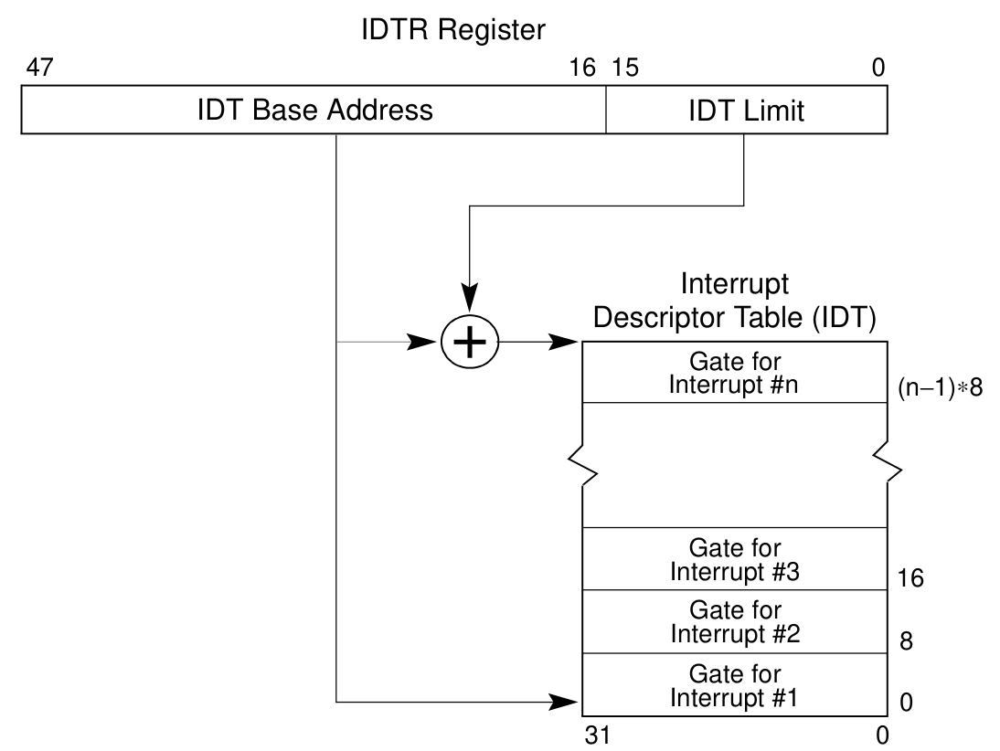
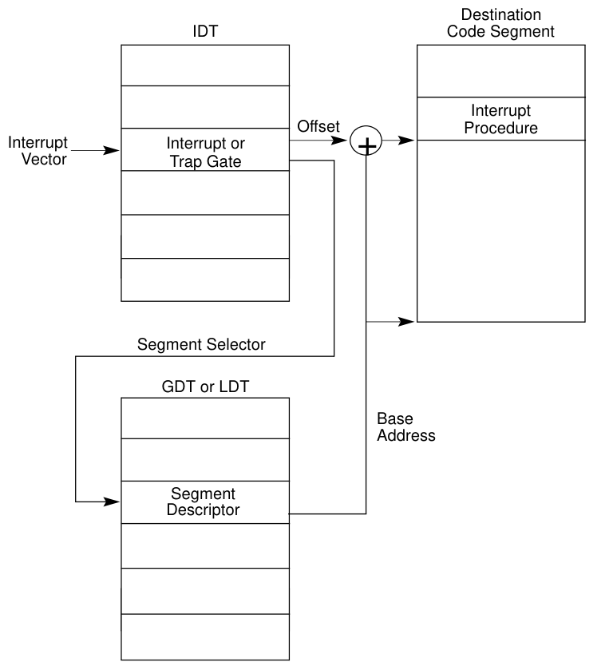
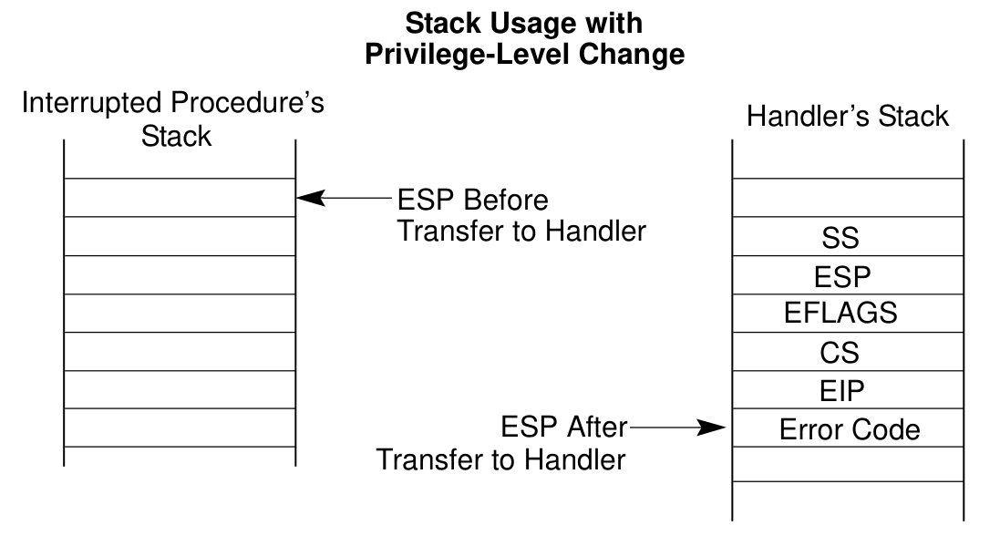
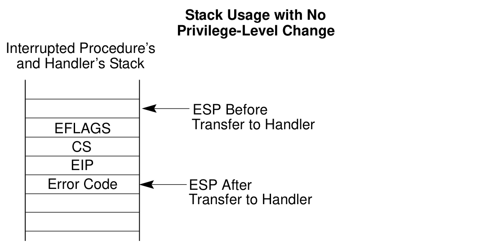

# 中断和异常处理

## 中断和异常处理概述

> - 什么是中断(Interupt)和异常(Exception)？
> - 处理器如何处理？
>
> 思考：实模式和保护模式下，中断向量表一样吗？

中断和异常是指系统、处理器或当前执行的程序或任务中存在需要处理器注意的事件。它们通常会导致执行从当前运行的程序或任务强制转移到一个称为中断处理程序或异常处理程序的特殊软件例程或任务。处理器响应中断或异常所采取的操作称为服务或处理中断或异常。

**中断**会在程序执行期间随机发生，作为对**硬件信号**的响应。系统硬件使用中断来处理处理器外部的事件，例如为外围设备提供服务的请求。软件也可以通过执行`INT n`指令来生成中断。

**异常**在处理器**执行指令**的过程中，**检测到错误**条件时发出，例如除以零。处理器检测各种错误情况，包括保护冲突、页面故障和内部机器故障。奔腾4、英特尔至强、P6系列和奔腾处理器的机器检查架构还允许在检测到内部硬件错误和总线错误时生成机器检查异常。

当**接收到中断**或**检测到异常**时，当前正在运行的过程或任务将**暂停**，此时处理器**执行中断或异常处理程序**。当处理程序的执行完成时，处理程序将继续执行被中断的过程或任务。中断的过程或任务的恢复不会失去程序的连续性，除非无法从异常中恢复，或中断导致当前运行的程序终止。

> 在**实模式**下，处理器的**中断向量表总是位于内存地址0**，而在**保护模式**下，中断向量表的位置存储在一个名为**IDTR**的CPU寄存器中。 

## 有关中断和异常了解性的内容

> - 中断和异常向量
> - 中断源和异常源
> - 异常的分类：故障、陷阱和中止
> - 程序或任务的重新执行
> - 开启和禁止中断
> - 异常和中断的优先级

### 中断和中断向量

为了帮助处理异常和中断，每个由架构定义的异常和每个需要处理器特殊处理的中断**都被分配了一个唯一的标识号**，称为**中断向量号**。处理器使用分配给异常或中断的向量号**作为中断描述符表（IDT）的索引**。该表提供了异常或中断处理程序的**入口点**（见第6.10节“中断描述符表（IDT）”）。**中断向量号的允许范围是`0`到`255`**。**范围为`0`到`31`**的中断向量号由英特尔64和IA-32**架构保留**，用于架构定义的异常和中断。并不是这个范围内的所有中断向量号都有当前被定义的函数。此范围中未分配的矢量号是保留的。不要使用保留的矢量号。

**范围在`32`到`255`**之间的中断向量号被指定为**用户定义**的中断，不由英特尔64和IA-32架构保留。这些中断通常分配给外部I/O设备，使这些设备能够通过一种外部硬件中断机制向处理器发送中断（见第6.3节“中断源”）。

### 中断源和异常源

中断源有两种：

- 外部中断(External (hardware generated) interrupts)
- 软件生成的中断(Software-generated interrupts)

异常源有三种：

- 处理器检测到程序错误异常(Processor-detected program-error exceptions)
- 软件生成的异常(Software-generated exceptions)
- 机器检查异常(Machine-check exceptions)

### 异常的分类：故障、陷阱和中止

异常被分类为**故障、陷阱或中止**，这取决于它们的报告方式以及导致异常的指令是否可以在不损失程序或任务连续性的情况下重新启动。

- **故障**(Fault)：故障是一种通常**可以纠正**的**异常**，一旦纠正，就可以在不丧失连续性的情况下重新启动程序。当报告故障时，处理器将机器状态**恢复到故障指令开始执行之前的状态**。故障处理程序的**返回地址**（CS和EIP寄存器的保存内容）指向**引起故障的指令**，而不是故障指令后面的指令。


- **陷阱**(Trap)：陷阱是在**执行陷阱指令后立即报告的异常**。陷阱允许程序或任务继续执行，而不会失去程序的连续性。陷阱处理程序的**返回地址**指向**陷阱指令之后**要执行**的指令**。


- **中止**(Abort)：中止是一种异常，它并不总是报告导致异常的指令的精确位置，并且**不允许重新启动导致异常的程序或任务**。中止用于报告严重错误，例如硬件错误和系统表中不一致或非法的值。


### 程序或任务的重新执行

为了允许在处理异常或中断后重新启动程序或任务，所有**异常**(中止除外)都保证在指令边界上报告异常。所有中断都保证发生在指令边界上。所有**中断**都保证在指令边界上发生。

对于**故障类异常**，**返回指令指针**（在处理器产生异常时保存）**指向导致错误的指令**。因此，当程序或任务在处理故障后重新启动时，故障指令将重新启动（重新执行）。**重启错误指令**通常用于**处理访问被阻止**时生成的异常。此类错误最常见的示例是页面错误异常 (`#PF`)，当程序或任务引用位于不在内存中的页面上的操作数时，就会发生这种情况。当发生页面错误异常时，异常处理程序可以将页面加载到内存中，并通过重新启动错误指令来恢复程序或任务的执行。为确保重新启动对当前正在执行的程序或任务是透明的，处理器**保存必要的寄存器和堆栈指针**以允许重新启动到执行错误指令之前的状态。

对于**陷阱类异常**，**返回指令指针**指向**陷阱指令之后的指令**。如果在**执行转移指令时检测到陷阱**，则返回指令指针会体现转移。例如，如果在**执行 `JMP` 指令时检测到陷阱**，则**返回指令指针指向 `JMP` 指令的目标**，而不是指向 `JMP` 指令之后的下一个地址。所有陷阱异常都允许程序或任务重新启动而不会失去连续性。例如溢出异常就是陷阱异常。对于溢出异常，返回指令指针指向 `INTO` 指令（测试 `EFLAGS.OF`（溢出标志））的之后的指令。此异常的陷阱处理程序解决了溢出情况。从陷阱处理程序返回后，程序或任务将继续执行 `INTO` 指令之后的指令。

对于**中止类异常**，**不支持**程序或任务的可靠**重启**。中止处理程序旨在**收集**有关发生中止异常时处理器状态的**诊断信息**，然后尽可能优雅地**关闭应用程序和系统**。

对于**中断**，严格**支持重新启动**被中断的程序和任务，而不会失去连续性。**为中断保存的返回指令指针**指向要在处理器接受中断的指令边界处执行的下一条指令。如果刚刚执行的指令有一个重复前缀，则在当前迭代结束时方才处理中断，并将寄存器设置为执行下一次迭代。

P6 系列处理器推测执行指令的能力不会影响处理器接受中断。中断发生在位于指令执行退出阶段的指令边界处；所以它们(指发生的中断)总是被带入“有序”指令流中。

请注意，奔腾处理器和更早的 IA-32 处理器也执行不同数量的预取和初步解码。对于这些处理器，在指令实际“按顺序”执行之前，不会发出异常和中断信号。对于给定的代码示例，当代码在任何 IA-32 处理器系列上执行时，异常信号统一发生（除非定义了新异常或新操作码）。

> 好像是在说，虽然指令的执行是乱序的，但是抛出异常和中断是有序的

### 开启和禁止中断

处理器会根据处理器的状态以及 `EFLAGS` 寄存器中的 `IF` 和 `RF` 标志的状态来抑制(inhibit)某些中断的产生，如以下部分所述。

#### 屏蔽可屏蔽的硬件中断

**`IF` 标志可以禁用**由处理器的 `INTR` 引脚上或通过本地 `APIC` 引起的**可屏蔽硬件中断**（请参阅第 6.3.2 节“可屏蔽硬件中断”）。当 `IF` 标志清0时，处理器禁止传递到 `INTR` 引脚或通过本地 `APIC` 产生内部中断请求的中断；当 `IF` 标志置1时，传送到 `INTR` 或通过本地 `APIC` 引脚引起中断将作为正常的外部中断处理。

**`IF` 标志不影响**传递到 NMI 引脚、或通过本地 APIC 传递的传递模式 NMI 消息导致的**不可屏蔽中断** (NMI) ，也不影响处理器生成的异常。与 `EFLAGS` 寄存器中的其他标志一样，处理器**清除 `IF` 标志以响应硬件复位**。

> 想起来Linux 0.00 `Boot.s`中，在将`Head.s`从`0x10000`复制到`0x0`的过程中，一开始就把`IF`给清零了

事实上，**可屏蔽硬件中断**组**包括保留中断和异常向量 `0` 到 `32`**，这可能会导致疑惑。在体系结构上，当设置 `IF` 标志时，从 `0` 到 `32` 的任何向量的中断都可以通过 `INTR` 引脚传送到处理器，并且可以通过本地 APIC 传送从 `16` 到 `32` 的任何向量。然后处理器将产生中断并调用向量号指向的中断或异常处理程序。因此，例如，可以通过 `INTR` 引脚调用页面错误处理程序（通过向量 `14`）；但是，这不是真正的页面错误异常，这是一个中断。对于 `INT n` 指令（请参阅第 6.4.2 节“软件生成的异常”），当通过 `INTR` 引脚向异常向量生成中断时，处理器不会将错误代码压入堆栈，因此异常处理程序可能无法正常运行。

> 异常会调用对应的中断向量表中的处理程序，当然也可以手动使用`INT n`直接去调用。但是异常在调用的时候可能会输入额外的信息，手动调用就不会输入额外的信息了，所以手动调用可能会出问题。

可以分别**使用 `STI`（设置中断允许标志）和 `CLI`（清除中断允许标志）指令设置或清除 IF 标志**。仅当 `CPL` 小于等于 `IOPL` 时，才可以执行这些指令。如果在 `CPL` 大于 `IOPL` 时执行它们，则会生成一般保护异常 (`#GP`)。 （当通过在控制寄存器 `CR4` 中设置 `VME` 标志启用虚拟模式扩展时，`IOPL` 对这些指令的影响略有修改：请参阅第 20.3 节，“虚拟 8086 模式下的中断和异常处理”。行为也受到影响PVI 标志：参见第 20.4 节“保护模式虚拟中断”。）

`IF` 标志还受以下操作的影响：

- `PUSHF` 指令将所有标志存储在堆栈中，可以在其中检查和修改它们。 `POPF` 指令可用于将修改后的标志加载回 `EFLAGS` 寄存器。
- 任务切换以及`POPF` 和 `IRET` 指令加载 `EFLAGS` 寄存器；因此，它们可用于修改 `IF` 标志的设置。
- 通过中断门处理中断时，`IF` 标志会自动清除，从而禁用可屏蔽硬件中断。 （如果中断是通过陷阱门处理的，则 `IF` 标志不会被清除。）

> See the descriptions of the CLI, STI, PUSHF, POPF, and IRET instructions in Chapter 3, “Instruction Set Reference, A-M,” in the Intel® 64 and IA-32 Architectures Software Developer’s Manual, Volume 2A, and Chapter 4, “Instruction Set Reference, N-Z,” in the Intel® 64 and IA-32 Architectures Software Developer’s Manual, Volume 2B, for a detailed description of the operations these instructions are allowed to perform on the IF flag.

#### 屏蔽指令断点

> Masking Instruction Breakpoints

EFLAGS寄存器中的**`RF`（恢复）标志**控制处理器对**指令断点**条件的响应(see the description of the RF flag in Section 2.3, “System Flags and Fields in the EFLAGS Register”)。

置1时，它会阻止指令断点生成调试异常（`#DB`）；清0时，指令断点将生成调试异常。RF标志的主要功能是防止处理器在指令断点上进入调试异常循环。

> See Section 17.3.1.1, “Instruction-Breakpoint Exception Condition,” for more information on the use of this flag.

#### 屏蔽任务切换时的异常和中断

要切换到不同的堆栈段，软件通常使用一对指令，例如：

```assembly
MOV SS, AX
MOV ESP, StackTop
```

如果在段选择子加载到`SS`寄存器之后但在`ESP`寄存器加载之前发生了中断或异常，则在中断或异常处理程序执行期间，堆栈空间逻辑地址的段选择子和段偏移是不匹配的。

为了防止这种情况，处理器在`MOV`到`SS`指令或`POP`到`SS`指令之后禁止中断、调试异常和单步陷阱异常，直到达到下一条指令之后的指令边界。所有其他故障仍可能产生。如果`LSS`指令用于修改SS寄存器的内容（这是修改此寄存器的推荐方法），则不会出现此问题。

### 异常和中断的优先级

如果在指令边界处有多个异常或中断，处理器将按既定顺序为它们提供服务。下表显示了异常和中断源之间的优先级。

| 优先级   | 描述                                                         |
| -------- | ------------------------------------------------------------ |
| 1(最高)  | Hardware Reset and Machine Checks<br/>- RESET<br/>- Machine Check |
| 2        | Trap on Task Switch(任务切换陷阱)<br/>- T flag in TSS is set |
| 3        | External Hardware Interventions(外部硬件)<br/>- FLUSH<br/>- STOPCLK<br/>- SMI<br/>- INIT |
| 4        | Traps on the Previous Instruction(上一条指令的陷阱)<br/>- Breakpoints(断点)<br/>- Debug Trap Exceptions(调试陷阱异常) (TF flag set or data/I-O breakpoint) |
| 5        | Nonmaskable Interrupts(不可屏蔽中断) (NMI)                   |
| 6        | Maskable Hardware Interrupts(可屏蔽硬件中断)                 |
| 7        | Code Breakpoint Fault(代码断点故障)                          |
| 8        | Faults from Fetching Next Instruction(取下一条指令时的故障) <br/>- Code-Segment Limit Violation<br/>- Code Page Fault |
| 9        | Faults from Decoding the Next Instruction(译码下一条指令时的故障) <br/>- Instruction length > 15 bytes <br/>- Invalid Opcode <br/>- Coprocessor Not Available |
| 10(最低) | Faults on Executing an Instruction<br/>- Overflow/Bound error/Invalid TSS/Segment Not Present/Stack fault/General Protection/Data Page Fault/Alignment Check/x87 FPU Floating-point exception/SIMD floating-point exception/Virtualization exception |

> 注：英特尔486处理器和早期处理器将不可屏蔽中断和可屏蔽中断分组在同一优先级类别中。

虽然表中列出的优先级在整个体系结构中是一致的，但每个优先级内异常的优先级都取决于实现，并且可能因处理器而异。

处理器**首先处理具有最高优先级的、尚未处理的异常或中断**，将执行转移到处理函数的第一条指令。**优先级较低的*异常*被*丢弃***；**优先级较低的*中断*保持*等待***。

虽然优先级较低的异常被丢弃了，但当中断处理程序将执行**返回到程序或任务中发生异常和/或中断的点**时，将**重新生成被丢弃的异常**。

## 中断描述符表

> - 如何构成？
> - 如何获得中断处理程序的地址？
> - 如何设置中断描述符表寄存器？

### 如何构成？

中断描述符表（IDT）**将每个异常或中断向量与**用于服务相关联的**异常或中断的过程、任务的门描述符**相关联。与GDT和LDT一样，IDT是一个**8字节描述符的数组**（在保护模式下）。与GDT不同，**IDT的第一个条目可能包含描述符**。为了在IDT中形成索引，处理器将异常或中断向量缩放八（门描述符中的字节数）。因为只有256个中断或异常向量，所以IDT不需要包含超过256个描述符。它可以包含少于256个描述符，因为描述符仅用于可能发生的中断和异常向量。IDT中的所有空描述符都应将描述符的当前标志设置为0。

IDT的基地址应该在8字节的边界上对齐，以最大限度地提高缓存线填充(cache line fills)的性能。表界限以字节表示，表界限添加到基地址以获得IDT最后一个有效字节的地址。界限值为0会产生正好1个有效字节。因为IDT条目总是八个字节长，所以限制应该总是比八的整数倍少一个（即`8N–1`）。

IDT可以位于线性地址空间中的任何位置。如下图所示，处理器使用`IDTR`寄存器定位IDT。此寄存器同时保存32位基址和IDT的16位表界限。




### 如何获得中断处理程序的地址？

处理器处理对异常和中断处理程序的调用，类似于用`CALL`指令处理对过程或任务的调用。当响应异常或中断时，**处理器使用异常或中断向量作为IDT中描述符的索引**。如果索引指向中断门或陷阱门，则处理器以类似于对调用门的CALL的方式调用异常或中断处理程序。如果索引指向任务门，则处理器以类似于CALL到任务门的方式执行到异常或中断处理程序任务的任务切换。

> 如果向量引用的描述符超出了IDT的表界限，则会生成一般保护异常（`#GP`）。

**中断门或陷阱门**引用在当前执行任务的上下文中运行的异常或中断处理程序过程。门的**段选择子指向**GDT或当前LDT中可执行代码段的**段描述符**。门**描述符**的偏移字段**指向异常或中断处理过程的入口**。

> 总结：中断向量是IDT的索引，从IDT中取出的门描述符中，包含一个LDT/GDT的段选择子和偏移。由段选择子获得段的基地址后，加上偏移，才是最终的地址。




当通过IDT中的**任务门**访问异常或中断处理程序时，会产生任务切换。用单独的任务处理异常或中断有几个优点：

- 被中断的程序或任务的整个上下文将自动保存；
- 新的TSS允许处理程序在处理异常或中断时使用新的特权级别0堆栈。如果当前特权级别0堆栈损坏时发生异常或中断，则通过任务门访问处理程序可以通过为处理程序提供新的特权级别0栈来防止系统崩溃。
- 通过给处理程序一个单独的地址空间，可以将其与其他任务进一步隔离。这是通过给它一个单独的LDT来完成的。

用单独的任务处理中断的缺点是，在任务交换时必须保存大量的机器状态，因而使其比使用中断门慢，从而导致中断延迟增加。

IDT中的任务门引用GDT中的TSS描述符（见下图）。切换到处理程序任务的处理方式与普通任务切换相同(see Section 7.3, “Task Switching”)。返回中断任务的链接存储在处理程序任务的TSS的上一个任务链接字段中。如果异常导致生成错误代码，则会将此错误代码复制到新任务的堆栈中。


### 如何设置中断描述符表寄存器？

`LIDT`（加载IDT寄存器）和`SIDT`（存储IDT寄存器）指令分别加载和存储`IDTR`寄存器的内容。`LIDT`指令加载`IDTR`寄存器，其中基址和表界限保存在内存操作数中。只有当CPL为0时，才能执行此指令。它通常由操作系统的初始化代码在创建IDT时使用。操作系统也可以使用它改变IDT。`SIDT`指令将存储在`IDTR`中的基址和表界限复制到内存中。此指令可以在任何特权级别执行。

## IDT 描述符

掌握以下描述符格式：

> - 中断门
> - 陷阱门
> - 任务门

### 中断门&陷阱门

> Interrupt-gate descriptor & Trap-gate descriptor, 手册P180, 6.11 IDT DESCRIPTORS

中断门和陷阱门同调用门（见第5.8.3节“调用门”）非常相似。它们包含一个远指针（段选择器和偏移量），处理器使用该指针将程序执行转移到异常或中断处理程序代码段中的处理程序过程。这些门的不同之处在于处理器处理EFLAGS寄存器中IF标志的方式（参见第6.12.1.2节“异常或中断处理程序使用标志”）。


### 任务门

> Task-gate descriptor, 手册P180, 6.11 IDT DESCRIPTORS;手册P230, 7.2.5 Task-Gate Descriptor

IDT中使用的任务门的格式与GDT或LDT中的任务门格式相同（见第7.2.5节，“任务门描述符”）。任务门包含异常和/或中断处理程序任务的TSS的段选择子。

任务门描述符提供了对任务的间接、受保护的引用。它可以放置在GDT、LDT或IDT中。任务门描述符中的TSS段选择子字段指向GDT中的TSS描述符，段选择子中的`RPL`未使用。

任务门描述符的DPL控制在任务切换期间对TSS描述符的访问。当程序或过程通过任务门调用或跳转到任务时，指向任务门的门选择子的`CPL`和`RPL`字段必须小于或等于任务门描述符的`DPL`。请注意，当使用任务门时，目标TSS描述符的`DPL`不被使用。


## 中断与异常处理的相关思考

### 中断过程调用的流程是怎样的？

答：触发中断-->查IDT获取处理函数地址，保存必要的信息-->执行处理函数-->（看情况）返回

### 如何判断中断处理过程与被中断任务的优先级？

答：如果“被中断任务”是普通的任务，那么只要没关中断，都会触发对应的中断处理过程；

如果“被中断任务”本身是中断处理过程，此时要考虑“相应处理优先级”来比较被中断任务与新中断的优先级。

### 不同优先级上，处理方式一样吗？

答：对于每一个具体的优先级，其内部各种情况的优先级要看架构的具体实现。

### 如果发生堆栈切换，处理器会做哪些操作？

答：如果处理程序过程将以较低的特权级别执行，则会发生堆栈切换。

当堆栈切换发生时：

1. 处理程序要使用的堆栈的段选择器和堆栈指针是从当前执行任务的TSS中获得的。**在这个新堆栈上，处理器将被中断过程的堆栈段选择子和堆栈指针入栈**；
2. 然后，处理器**将`EFLAGS`、`CS`和`EIP`寄存器的当前状态保存在新堆栈**上；
3. 如果要保存异常的错误代码，则会将其压入到`EIP`值之后的新堆栈上。



> 参考6.12.1 Exception- or Interrupt-Handler Procedures

### 如果没发生堆栈切换，处理器会做哪些操作？

答：如果中断处理程序过程将以与被中断过程相同的权限级别执行，此时不发生堆栈切换，处理器执行：

1. 处理器**将`EFLAGS`、`CS`和`EIP`寄存器的当前状态保存在*当前堆栈***上；
2. 如果要保存异常的错误代码，则会将其压入到`EIP`值之后的当前堆栈上。



> 参考6.12.1 Exception- or Interrupt-Handler Procedures

### 中断处理过程后，如何返回，处理器做了哪些操作？

要从异常或中断处理程序过程返回，处理程序**必须使用`IRET`（或`IRETD`）指令**。

`IRET`指令与`RET`指令类似，但`IRET`指令还要**将调用中断处理程序时保存的标志恢复到`EFLAGS`寄存器中**。只有当`CPL`为0时，才会恢复`EFLAGS`寄存器的`IOPL`字段。只有当`CPL`小于或等于`IOPL`时，才会更改`IF`标志。

如果调用处理程序过程时发生堆栈切换，则IRET指令**在返回时切换回中断过程的堆栈**。

>参考6.12.1 Exception- or Interrupt-Handler Procedures

### 异常和中断处理过程的保护

异常和中断处理程序过程的特权级别保护类似于通过调用门调用普通过程的特权级别(see Section 5.8.4, “Accessing a Code Segment Through a Call Gate”)。 处理器不允许将执行转移到特权低于CPL的代码段（数字上的特权级别更高）中的异常或中断处理程序过程。

试图违反此规则会导致一般保护异常（`#GP`）。异常和中断处理程序过程的保护机制在以下方面有所不同：

- 因为中断和异常向量没有`RPL`，所以在对异常和中断处理程序的隐式调用中不会检查`RPL`；
- 只有当`INT n`、`INT 3`或`INTO`指令产生异常或中断时，处理器才会检查中断或陷阱门的DPL。此时，CPL必须小于或等于门的DPL。此限制可防止以特权级别3运行的应用程序或过程使用软件中断访问关键异常处理程序，如页面错误处理程序，前提是这些处理程序位于特权更高的代码段中（在数字上较低的特权级别）。对于硬件生成的中断和处理器检测到的异常，处理器会忽略中断和陷阱门的DPL。

由于异常和中断通常不会在可预测的时间发生，因此这些特权规则有效地限制了异常和中断处理过程可以运行的特权级别。可以使用以下任一技术来避免违反权限级别：

- 异常或中断处理程序可以放置在一致的代码段中。这种技术可以用于只需要访问堆栈上可用数据的处理程序（例如，划分错误异常）。如果处理程序需要来自数据段的数据，则需要从权限级别3访问该数据段，这将使其不受保护。
- 处理程序可以放置在权限级别为0的不一致代码段中。无论被中断的程序或任务在哪个CPL上运行，该处理程序都将始终运行。

### 异常和中断处理过程的标志使用方式

答：当通过中断门或陷阱门访问异常或中断处理程序时，处理器在堆栈上保存`EFLAGS`寄存器的内容后，清除`EFLAGS`寄存器中的`TF`标志。（在调用异常和中断处理程序时，处理器还会在`EFLAGS`寄存器中的`VM`、`RF`和`NT`标志保存在堆栈上后清除这些标志。）清除`TF`标志可防止指令跟踪影响中断响应。随后的`IRET`指令将`TF`（以及`VM`、`RF`和`NT`）标志恢复为堆栈上`EFLAGS`寄存器的保存内容中的值。

> 参考6.12.1.2 Flag Usage By Exception- or Interrupt-Handler Procedure，P184

### 中断门与陷阱门的唯一区别是什么？

答：中断门和陷阱门之间的**唯一区别是处理器处理`EFLAGS`寄存器中`IF`标志的方式**。当**通过中断门**访问异常或中断处理过程时，**处理器清除`IF`标志**，以防止其他中断干扰当前中断处理程序。随后的`IRET`指令将`IF`标志恢复到堆栈上`EFLAGS`寄存器保存内容中的值。**通过陷阱门访问**处理程序过程**不会影响`IF`标志**。

> 参考6.12.1.2 Flag Usage By Exception- or Interrupt-Handler Procedure，P184

