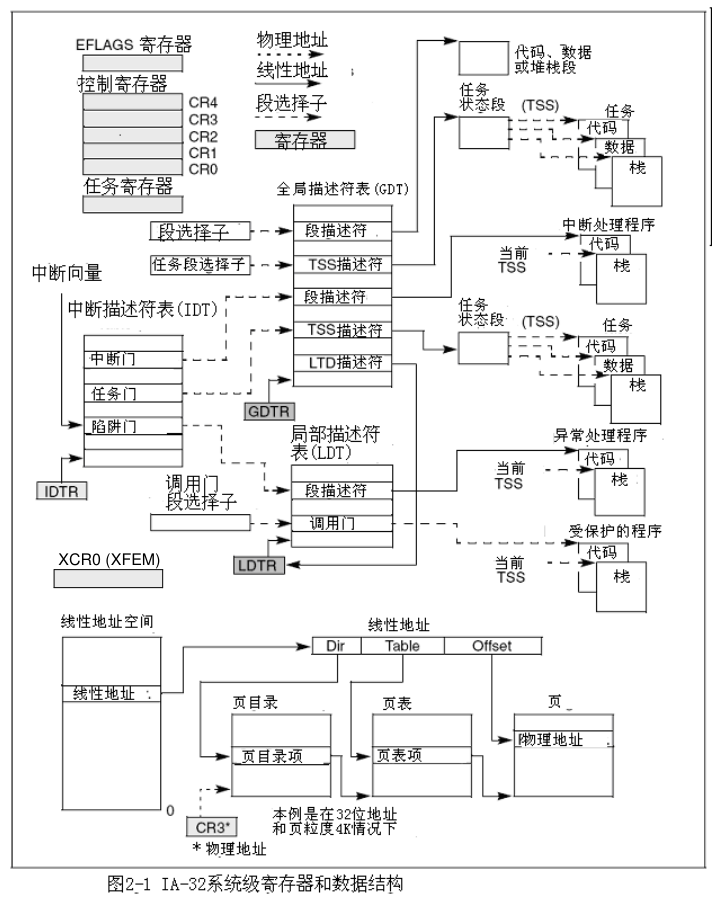
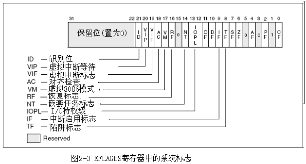
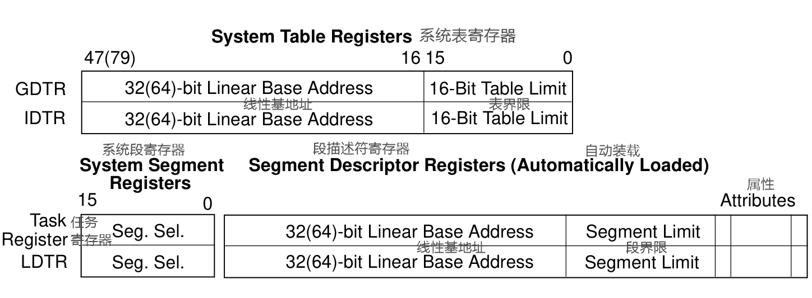
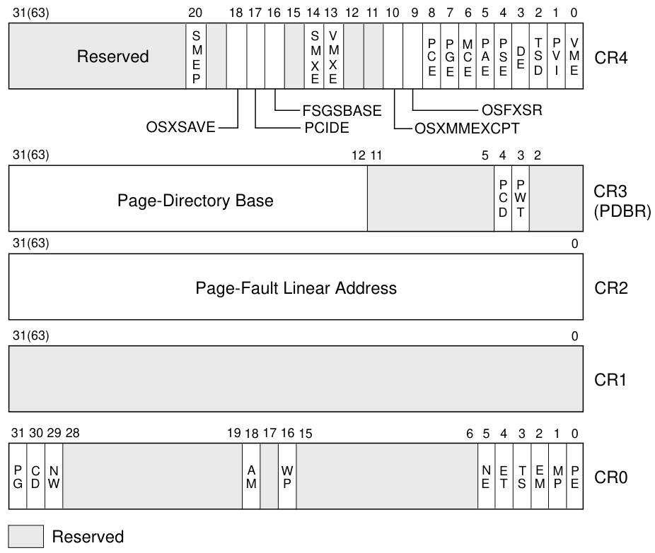

# x86系统架构概览

## 系统级体系结构概览

> 图中的实线箭头表示线性地址(Linear Address)，虚线表示段选择子(Segment Selector)，点线表示物理地址(Physical Selector)。为了简单起见，许多段选择器画成了直接指向段的指针。然而，从段选择器到相关段的实际路径总是要通过GDT或LDT的。

> 补充CSAPP略微讲过的逻辑地址、线性地址和物理地址：

以下内容是要重点掌握的：

### Global and Local Descriptor Tables

> 全局描述符表(GDT, Global Descriptor Tables)/局部描述符表(LDT, Local Descriptor Tables)

在保护模式下，所有的访存操作都需要查全局描述符表(GDT, Global Descriptor Tables)、(可能查)局部描述表(LDT, Local Descriptor Tables)。

GDT和LDT中的每一项为**段描述符**(Segment Descriptor)，段描述符中包含段基
地址(base address)、访问特权(access rights)、类型(access rights)和用法信息(usage information)。

每一个段描述符都有一个与之相关联的**段选择子**(Segment Selector)。段选择子为使用它的软件提供表索引(本质就是相对于表基址的偏移)、一个全局/局部信息(是GDT还是LDT)和访问权限信息，以便定位需要的段描述符。

要想访问内存中的某个字节，首先要求当前正在执行代码段的特权级别(CPL, Current Privilege Level)满足段描述符中的访问特权；然后根据段选择子找到对应的段描述符，通过段描述符拿到段基址；最后将段基址加上偏移量，得到欲访问字节的线性地址后便可以访问。

GDT线性基地址在GDT寄存器(**GDTR**, GDT Register)中；LDT的线性基地址包含在LDT寄存器(**LDTR**, LDT Register)中。

> 想到了CSAPP讲虚拟内存那块的时候捎带讲了些相关的内容，如下图所示

### System Segments, Segment Descriptors, and Gates

> 系统段(System Segments)、段描述符(Segment Descriptors)和门(Gates)

除了代码段、数据段和栈段这三个组成程序执行环境的段之外，X86还提供了**两种系统段**(System Segments)：**任务状态段**(**TSS**, Task-state Segment)和**LDT**。

> 既然TSS和LDT是段，那么一定有属于他们的段选择子和段描述符。

> 之所以LDT能被看作是段、而GDT不能看作段，是因为我们只能通过GDTR、不能通过段选择子(和对应的段描述符)访问GDT。但在图2-1中，如果我们想要访问LDT，除了通过LDTR，也可以通过GDT的一个段选择子拿到LDT相关的段描述符，拿到了段描述符意味着拿到了基址，从而可以进行访问。

系统架构还提供了一类特殊的段描述符，称为**门**(**Gate**)，包括**调用门**(Call Gates)、**中断门**(Interrupt Gates)、**陷阱门**(Trap Gates)和**任务门**(Task Gates)。门提供了一种受保护的访问系统过程和处理函数的途径，而这些过程和处理函数的特权级可能和应用程序、大多数过程的特权级不匹配(一般是被调用函数的特权更高)。

例如，图2-1的LDT中有**调用门**。对调用门进行`CALL`操作可以让特权级更低(或相等)的过程访问特权级更高的过程(代码片段)。

调用过程提供了调用门的段选择子以通过调用门访问过程，然后处理器对调用门执行访问权限检查，将CPL与调用门的特权级别和调用门所指向的目标代码段进行比较。如果允许访问目标代码段，处理器获取目标代码段的段选择子，并从调用门获取该代码段的偏移量。如果调用需要更改特权级别，处理器也会切换到目标特权级别的堆栈。新堆栈的段选择子是从当前运行任务的TSS中获得的。对门的操作也可能会进行16位代码段和32位代码段之间的转换，反之亦然。

### Task-State Segments and Task Gates

> 任务状态段(Task-State Segments)和任务门(Task Gates)

任务状态段(TSS)定义了任务执行环境的状态，包括通用寄存器、段寄存器、`EFLAGS`寄存器、`EIP`寄存器和三个堆栈段(特权 0、1、2 各一个堆栈)段选择子、与任务相关的LDT的段选择子、页表的基地址等。

> 注：关于`EFLAGS`寄存器和`EIP`寄存器
>
> `EFLAGS`寄存器详见下文`System Register`部分；
>
> `EIP`寄存器主要用于存放当前代码段即将被执行的下一条指令的偏移，但其本质上并不能直接被指令直接访问，由控制转移指令、中断及异常所控制。（和计组中的`IP`是一个意思）

所有在保护模式下运行的程序，都是在某个任务的**上下文**(Context)中进行的，这个任务被称为“当前任务”(Current Task)。**当前任务的TSS的段选择子**保存在**任务寄存器**(Task Register)中。

切换任务最简单的方式是用`CALL`或者`JUMP`指令，并将目标任务的TSS的段选择子嵌入指令中。在切换任务的过程中，处理器会做下面的工作：

1. 把当前任务的状态存到它的TSS中；
2. 把新任务的TSS的段选择子加载到任务寄存器(Task Register)中；
3. 通过段选择子，在GDT中找到段描述符，进而访问新任务的TSS；
4. 将新任务的TSS中的状态加载到通用寄存器、段寄存器、LDTR寄存器、CR3、EFLAGS寄存器和EIP寄存器；
5. 开始执行新任务: )

我们也可以使用任务门访问新任务。任务门和前面提到的调用门很类似，只不过任务门是访问TSS的，而调用门是访问代码段的。

### Interrupt and Exception Handling

> 中断和异常处理(Interrupt and Exception Handling)

外部中断、软件中断和异常都是通过中断描述符表(IDT, Interupt Descriptor Table)处理的。

IDT存储一组门(要记得门是段描述符的一种唷)，这些门(特殊的段描述符)提供对中断和异常处理程序的访问。与GDT一样，IDT也不是一个段。IDT的线性基地址记录在IDT寄存器(IDTR)中。

IDT中的门可以是中断门、陷阱门或任务门。当发生中断或异常时，为了访问中断或异常处理程序，处理器首先通过INT、INTO、INT 3或BOUND指令从内部硬件、外部中断控制器或软件接收**中断向量**(Interrupt Vector)。中断向量提供IDT的索引。如果选择的门是中断门或陷阱门，则以类似于通过调用门调用过程的方式访问相关的处理程序过程。如果描述符是一个任务门，则通过切换任务的方式来访问处理程序。

> 提到中断向量，就想起了组成原理讲过的一些东西...如下面两张图所示，介绍了中断向量时怎么产生的，通过具体例子分析了上文描述的文字过程。

### Memory Management

> 内存管理(Memory Management)
>
> 通过上面的内容可以知道“段页式”管理中的“段”是如何转换的，下面看看“页”是一种什么机制

X86系统架构支持内存或虚拟内存的直接物理寻址(对于虚拟内存，须通过分页机制)。

当使用物理寻址时，线性地址被视为物理地址；当使用分页时：所有代码、数据、堆栈和系统段（包括GDT和IDT）都可以进行分页，只有最近访问的页面才能保存在物理内存中。

页（有时称为页框）在物理内存中的位置被记录在相关的数据结构中(指**页目录**(Page Directory)和**页表**(Page Table))。这些结构驻留在物理内存中。**页目录**包含有**页表**的物理地址、访问特权、内存管理信息，**页表**中包含有**页框**的物理地址、访问特权和内存管理信息。页目录的基地址保存在控制寄存器CR3中。

为使用分页机制，**一个线性地址被分为三个部分：页目录、页表和页框中的偏移量**(可以看图2-1最下面的部分)。一个系统可以有一个或者多个页目录，比如每个任务都可以有自己的页目录。

### System Registers

为了有助于初使化处理器及控制系统的运行，架构在`EFLAGS`寄存器和几个系统寄存器中提供了一些系统标志：

1. 在`EFLAGS`寄存器内的系统标志和IOPL域，控制着任务和模式切换、中断处理、指令跟踪和访问特权；
2. 控制寄存器(`CR0`、`CR2`、`CR3`和`CR4`)包含用于控制系统级操作的各种标志和数据字段。这些寄存器中的其他标志用于指示对操作系统或执行程序中的特定处理器功能的支持；
3. 调试寄存器允许设置断点，用于调试程序和系统软件；
4. `GDTR`、`LDTR`和`IDTR`寄存器包含各自表的线性地址和大小(限制)；
5. 任务寄存器包含当前任务的TSS的线性地址和大小(好像前面说任务寄存器存的是TSS的段选择子来着？)；
6. 特殊模块寄存器(MSR, Model-specific registers)

特殊模块寄存器(MSR)是*一组*寄存器，主要可用于操作系统或执行过程（指在特权级别0下运行的代码）。这些寄存器控制诸如调试扩展、性能监视计数器、机器检测架构和内存类型范围（MTRRs）之类的项目。这些寄存器的数量和功能因英特尔64和IA-32处理器系列的不同成员而异。

大多数系统限制应用程序访问系统寄存器(`EFLAGS`寄存器除外)。但是，系统可以设计为所有程序和过程都以最高特权级别(特权级别0)运行。在这种情况下，应用程序将被允许修改系统寄存器。

## 实模式和保护模式转换

> 了解两种操作模式进行转换，所需要进行哪些修改。

> 『在多用户、多任务时代，内存中会有多个用户(应用)程序在同时运行。为了使它们彼此隔离，防止因某个程序的编写错误或者崩溃而影响到操作系统和其他用户程序，使用保护模式是非常有必要的。』——《x86汇编语言 从实模式到保护模式》

### x86中的四种模式

- **实模式**(Real-address mode)：此操作模式提供Intel 8086处理器的编程环境，并具有少部分扩展（例如切换到保护模式或系统管理模式）。
- **保护模式**(Protected mode)：保护模式是处理器的原生操作模式。它提供了一套丰富的架构特性、灵活性、高性能和对现有软件库的向后兼容性。
- **系统管理模式**(SMM, System management mode)：系统管理模式(SMM)在所有的IA-32处理器中是一个标准的架构特征，它首先在intel 386 SL处理器中出现。此模式为操作系统或执行程序提供了透明机制，用于实现电源管理和OEM差异化功能。系统管理模式(SMM)是通过激活外部系统中断引脚(`SMI#`)进入的，该引脚生成系统管理中断（SMI）。在SMM中，处理器切换到单独的地址空间，同时保存当前运行的程序或任务的上下文，然后可以透明地执行SMM特定代码；在从SMM返回时，处理器被置于回到其在SMI之前的状态。
- **虚拟8086模式**(`Virtual-8086 mode`)：在保护模式下，处理器支持被称为虚拟8086模式的准操作模式。此模式允许处理器在受保护的多任务环境中执行8086软件。

### 模式间的转换

通电或复位后，处理器处于实模式。控制寄存器`CR0`中的`PE`标志随后控制处理器是在实模式还是在保护模式下操作。

`EFLAGS`寄存器中的`VM`标志确定处理器是在保护模式下操作还是在虚拟8086模式下操作。保护模式和虚拟8086模式之间的转换通常作为任务切换或中断或异常处理程序返回的一部分来执行。

当处理器处于实模式、受保护、虚拟8086模式时，每当处理器接收到`SMI`时，处理器切换到系统管理模式。在执行`RSM`指令时，处理器总是返回到发生SMI时的模式。(退出SMM需要使用`RSM`指令。该指令会恢复之前的CPU上下文，就好像从来没有发生过SMI一样。)

## 80x86系统指令寄存器

了解和掌握相关寄存器：

### 标志寄存器 `EFLAGS`

`EFLAGS`寄存器的系统标志和`IOPL`字段控制I/O、可屏蔽硬件中断、调试、任务切换和虚拟8086模式。应该只允许特权代码（通常是操作系统或执行代码）修改这些位。

`EFLAGS`寄存器中有下列的系统标志和`IOPL`字段：

- `TF`(Trap Flag, 陷阱标志, 第8位)：置1为启用单步模式进行调试；清0为禁用单步模式。在单步模式中，处理器在每条指令之后生成一个调试异常。这允许在每条指令被执行后检查程序的执行状态。如果应用程序使用`POPF`、`POPFD`或`IRET`指令设置TF标志，则在`POPF`、`POPFD`或`IRET`后面的指令之后会生成调试异常。

- `IF`(Interrupt Enable Flag, 中断允许标志, 第9位)：`IF`标志控制处理器对可屏蔽硬件中断请求的响应，置1为响应可屏蔽的硬件中断；清0为禁止可屏蔽硬件中断。`IF`标志不影响异常或不可屏蔽中断（NMI中断）的生成。控制寄存器`CR4`中的`CPL`、`IOPL`和`VME`标志的状态确定`IF`标志是否可以由`CLI`、`STI`、`POPF`、`POPFD`和`IRET`修改。

- `IOPL`(I/O Privilege Level Field, I/O特权级, 第12位和13位)：指示当前正在运行的程序或任务的I/O特权级别（IOPL）。当前运行的程序或任务的CPL必须小于或等于IOPL才能访问I/O地址空间。POPF和IRET指令只能在CPL为0时修改此字段。

  当虚拟模式扩展(Virtual Mode Extensions)生效时（`CR4.VME=1`），`IOPL`也是控制`IF`标志的修改和虚拟8086模式下中断处理的机制之一。

- `NT`(Nested Task Flag, 嵌套任务标志, 第14位)：`NT`标志控制中断任务和调用任务的链接。处理器在调用由CALL指令、中断或异常启动的任务时将此标志置1；当任务因调用`IRET`指令而返回时，检查并修改此标志。该标志可以用`POPF`/`POPFD`指令显式设置或清除；然而，更改为该标志的状态可能会在应用程序中产生意外的异常。

- `RF`(Resume Flag, 暂停标志, 第16位)：`RF`标志控制处理器对指令断点条件的响应。设置此标志后，将暂时禁止为指令断点生成调试异常（`#DB`）（尽管其他异常条件可能会导致生成异常）。清除时，指令断点将生成调试异常。

  `RF`标志的主要功能是允许重启调试异常(由指令断点条件引起的)之后的指令。在这里，调试软件必须先在堆栈上的`EFLAGS`映像中设置此标志，然后才能使用`IRETD`返回到中断的程序（以防止指令断点造成另一个调试异常）。当返回到已成功执行的指令之后，处理器会自动清除此标志，从而再次启用指令断点故障。

- `VM`(Virtual-8086 Mode, 虚拟8086模式, 第17位)：置1为启用虚拟8086模式；清0为返回到保护模式。

- `AC`(Alignment check, 对齐检查, 第18位)：设置此标志和控制寄存器`CR0`中的`AM`标志，以启用内存引用的对齐检查；清除`AC`标志和/或(and/or)`AM`标志以禁用对齐检查。当引用未对齐的操作数时，会生成对齐检查异常，例如奇数字节地址处的字(2 Byte)或不是四的整数倍的地址处的双字(4 Byte)。对齐检查异常仅在用户模式下生成（Privilege mode 3）。默认为特权级别0的内存引用，如段描述符加载，即使是由在用户模式下执行的指令引起的，也不会生成此异常。

  对齐检查异常可用于检查数据的对齐情况。这在与需要对齐所有数据的处理器交换数据时非常有用。对齐检查异常也可以被解释器用来将某些指针错误地对齐从而使之成为特殊指针，这消除了检查每个指针的开销，并且在使用时只处理特殊指针。

- `VIF`(Virtual Interrupt Flag, 虚拟中断标志, 第19位)：包含`IF`标志的虚拟映像。此标志与`VIP`标志一起使用。只有当控制寄存器`CR4`中的`VME`标志或`PVI`标志被设置并且`IOPL`小于3时，处理器才识别`VIF`标志。（`VME`标志启用虚拟8086模式扩展；`PVI`标志启用受保护模式虚拟中断。）

- `VIP`(Virtual Interrupt Pending, 虚拟中断等待, 第20位)：由软件设置，若为1则指示有中断正在等待被处理；为0则指示没有等待处理的中断。此标志与`VIF`标志一起使用。处理器读取此标志，但从不修改它。只有当控制寄存器`CR4`中的`VME`标志或`PVI`标志被设置并且`IOPL`小于3时，处理器才能识别`VIP`标志。（`VME`标志启用虚拟8086模式扩展；PVI标志启用受保护模式虚拟中断。）

- `ID`(Identification Flag, 识别标志, 第21位)：由软件置1或清0，表明是否支持CPUID指令

### 内存管理寄存器

处理器提供四个内存管理寄存器（`GDTR`、`LDTR`、`IDTR`和`TR`），用于指定控制段式内存管理的数据结构的位置；除此还提供了用于读写这些寄存器的特殊指令。

#### GDTR

`GDTR`寄存器保存`GDT`的基址（在保护模式下为32位；在IA-32e模式下为64位）和16位表界限。基址指定GDT的字节0的线性地址；表界限指定表中的字节数。

`LGDT`和`SGDT`指令分别加载和存储`GDTR`寄存器。处理器通电或复位时，基址被设置为默认值`0`，表界限被设置为`0FFFFH`。在保护模式操作的处理器初始化过程中，必须将新的基址加载到GDTR中。

#### LDTR

`LDTR`寄存器保存**LDT的**16位段选择子、基址（在保护模式下为32位；在IA-32e模式下为64位）、段界限和段描述符属性。基址指定了LDT段的字节0的线性地址；段界限指定了LDT段中的字节数。

`LLDT`和`SLDT`指令分别加载和存储`LDTR`寄存器的段选择子部分。包含LDT的段必须在GDT中有段描述符。当`LLDT`指令将段选择子加载到`LDTR`中时：LDT描述符的基地址、限制和描述符属性会*自动*加载到`LDTR`中。

当任务切换发生时，`LDTR`会自动加载新任务的LDT的段选择器和描述符。在将新的LDT信息写入寄存器之前，`LDTR`的内容**不会**自动保存。

处理器通电或复位时，`LDTR`中的段选择子和基址被设置为默认值0，段界限设置为`0FFFFH`。

#### IDTR

`IDTR`寄存器保存IDT的基址（在保护模式下为32位；在IA-32e模式下为64位）和16位表界限。基址指定IDT的字节0的线性地址；表界限指定表中的字节数。`LIDT`和`SIDT`指令分别加载和存储`IDTR`寄存器。处理器通电或复位时，基址被设置为默认值0，表界限被设置为`0FFFFH`。

#### TR

任务寄存器`TR`保存当前任务TSS的16位段选择子、基址（保护模式下为32位；IA-32e模式下为64位）、段界限和段描述符属性。选择器引用GDT中的TSS描述符。基址指定TSS的字节0的线性地址；段限制指定TSS中的字节数。

`LTR`和`STR`指令分别加载和存储任务寄存器的段选择子部分。当`LTR`指令在任务寄存器`TR`中加载段选择子时，TSS描述符的基址、段界限和描述符属性会自动加载到任务寄存器`TR`中。处理器通电或复位时，基本地址被设置为默认值0，段界限被设置为`0FFFFH`。

当发生任务切换时，任务寄存器`TR`会自动加载新任务TSS的段选择子和段描述符。在将新的TSS信息写入寄存器之前，任务寄存器的内容**不会**自动保存。

### 控制寄存器

控制寄存器（`CR0`、`CR1`、`CR2`、`CR3`和`CR4`）决定处理器的操作模式和当前执行任务的特性。这些寄存器在所有32位模式和兼容模式下都是32位的，在64位模式中，控制寄存器被扩展到64位。

- `CR0`寄存器：包含控制处理器**操作模式和状态**的系统控制标志；
  - `PG`(Paging, 分页, `CR0`第31位)：置1为启用分页；清0为禁用分页；
  - `CD`(Cache Disable, 禁用缓存, `CR0`的第30位)：当`CD`和`NW`标志为0时，处理器中内部（和外部）内存位置的高速缓存将启用。当`CD`标志置1时，高速缓存将会被禁用；
  - `NW`(Not Write-through, 不写直达, `CR0`的第29位)：当NW和CD标志为0时，将为**命中缓存**的写操作启用回写（针对奔腾4、英特尔至强、P6系列和奔腾处理器）或直写（针对Intel486处理器），并启用失效循环；
  - `AM`(Alignment Mask, 对齐屏蔽, `CR0`的第18位)：置1时启用自动对齐检查；清0时禁用对齐检查。只有当`AM`标志被设置，`EFLAGS`寄存器中的`AC`标志被设置、CPL为3并且处理器在受保护或虚拟8086模式下操作时，才执行对齐检查；
  - `WP`(Write Protect, 写保护, `CR0`的第16位)：置1时禁止管理级的程序往只读页中写，清0时允许管理级的程序往只读页中写(无论U/S位被设置为何值)。此标志有助于实现UNIX等操作系统中创建(forking)新进程时的`copy-on-write`方法；
  - `NE`(Numeric Error, 数值错误, `CR0`的第5位)：置1时启用原生的（内部的）x87 FPU错误报告机制，清0时启用类PC的x87 FPU错误报告机制；
  - `ET`(Extension Type, 拓展类型, `CR0`的第4位)：在Intel386和Intel486处理器中，此标志置1时表示支持Intel 387 DX数学协处理器指令；
  - `TS`(Task Switched, 任务切换, `CR0`的第3位)：处理器在每次切换任务时设置此标志，并在执行x87 FPU/MMX/SSE/SSE2/SSE3/SSSE3/SSE4指令时对其进行测试；
  - `EM`(Emulation, 仿真, `CR0`的第2位)：置1时表示处理器没有内部或外部x87 FPU；清0时表示存在x87 FPU；
  - `MP`(Monitor Coprocessor, 监测协处理器, `CR0`的第1位)
  - `PE`(Protection Enable, 启用保护模式, `CR0`的第0位)：置1时启用保护模式；清0时启用实模式。此标志不会直接启用分页。它只启用分段级别的保护。要启用分页，必须同时设置`PE`和`PG`标志。

- `CR1`寄存器：保留未使用；

- `CR2`寄存器：包含**页面故障线性地址**(导致页面故障的线性地址)；

- `CR3`寄存器：包含**页目录**的基地址和两个标志(`PCD`和`PWT`)。在CR3寄存器中，只指定基地址的最高有效位(除了低12位)，而低12位被假定为0；因此，页目录地址必须与页面（4KB）边界对齐。`PCD`和`PWT`标志控制在处理器的内部数据高速缓存中的页目录信息（不控制TLB中的页目录信息）。

- `CR4`寄存器：包含一组标志，用于启用多个架构拓展、指示操作系统或执行层对特定处理器功能的支持。可以使用`MOV`指令的移入或移出控制寄存器形式(move-to-or-from-control-registers forms)来读取和写（或修改）控制寄存器。在保护模式下，`MOV`指令允许读取或写控制寄存器（仅在特权级别0）。这种限制意味着应用程序或操作系统过程（以特权级别1、2或3运行的）被阻止读取或加载控制寄存器。

  - `VME`(Virtual-8086 Mode Extensions, 虚拟8086模式拓展, `CR4`的第0位)

    置1时，在虚拟8086模式下启用中断和异常处理扩展；清0时，禁用扩展。使用虚拟模式扩展可以在执行8086程序时消除调用虚拟8086监视器处理中断和异常的开销，并将中断和异常重定向回8086程序的处理程序，以提高虚拟8086应用程序的性能。它还提供了对虚拟中断标志（VIF）的硬件支持，以提高在多任务和多处理器环境中运行8086程序的可靠性。

  - `PVI`(Protected-Mode Virtual Interrupts, 保护模式下的虚拟中断, `CR4`的第1位)

    置1时，在保护模式下启用对虚拟中断标志（VIF）的硬件支持；清0时，在保护模式下禁用VIF标志。

  - `TSD`(Time Stamp Disable, 禁用时间戳, `CR4`的第2位)

    置1时，限制运行在0级特权下的程序执行`RDTSC`指令；清0时，允许`RDTSC`指令以任何特权级别执行。如果支持`RDTSCP`指令(`if CPUID.80000001H:EDX[27] = 1`)，此位也适用于`RDTSCP`指令。

  - `DE`(Debugging Extensions, 调试拓展, `CR4`的第3位)

    置1时，对调试寄存器`DR4`和`DR5`的引用会导致生成未定义的操作码（#`UD`）异常；清0时，处理器别名引用寄存器DR4和DR5，以与为在早期IA-32处理器上运行而编写的软件兼容。

  - `PSE`(Page Size Extensions, 页尺寸拓展, `CR4`的第4位)

    置1时，32位分页机制下的页大小为4M字节；清0时，32位分页机制下的页大小为4K字节。

  - `PAE`(Physical Address Extension, 物理地址拓展, `CR4`的第5位)

    置1后，启用分页以生成超过32位的物理地址。清0时，将物理地址限制为32位。在进入IA-32e模式之前，必须设置`PAE`。)

  - `MCE`(Machine-Check Enable, 启用机器检测, `CR4`的第6位)

    置1时，启用机器检测(machine-check)异常；清0时，禁用机器检测异常。

  - `PGE`(Page Global Enable, 启用全局页, `CR4`的第7位)

    (在P6系列处理器中引入)置1时启用全局页，清0时禁用全局页。全局页面功能允许频繁使用或共享的页面对所有用户标记为全局页面（使用页目录或页表条目中的全局标志位8完成）。全局页在任务切换或写寄存器CR3时，不从TLB中刷新。

    启用全局页功能时，必须在设置`PGE`标志之前启用分页机制（通过设置控制寄存器`CR0`中的`PG`标志）。颠倒此顺序可能会影响程序的正确性，处理器性能也会受到影响。

  - `PCE`(Performance-Monitoring Counter Enable, 启用性能检测计数器, `CR4`的第8位)

    置1时，允许在任何保护级别运行的程序或过程中使用`RDPMC`指令；清0时，`RDPMC`指令只能在保护级别0下执行。
    
  - `OSFXSR`(Operating System Support for FXSAVE and FXRSTOR instructions, 操作系统对FXSAVE和FXRSTOR指令的支持, `CR4`的第9位)
  
  - `OSXMMEXCPT`(Operating System Support for Unmasked SIMD Floating-Point Exceptions, 操作系统支持未屏蔽的SIMD浮点异常, `CR4`的第10位)
  
  - `VMXE`(VMX-Enable Bit, VMX启用位, `CR4`的第13位)
  
    > 注：VMX即Virtual-Machine Extensions，虚拟机拓展
  
  - `SMXE`(SMX-Enable Bit, SMX启用位, `CR4`的第14位)
  
    > 注：SMX即Safe Mode Extensions，安全模式拓展
  
  - `FSGSBASE`(FSGSBASE-Enable Bit, `CR4`的第16位)
  
    启用指令`RDFSBASE`、`RDGSBASE`、`WRFSBASE`和`WRGSBASE`。
  
  - `PCIDE`(PCID-Enable Bit, `CR4`的第17位)
  
  - `OSXSAVE`(XSAVE and Processor Extended States-Enable Bit, `CR4`的第18位)
  
  - `SMEP`(SMEP-Enable Bit, `CR4`的第20位)
  
    > 注：SMEP即supervisor-mode execution prevention
  
    

注：写控制寄存器时，保留位应始终设置为先前读取的值。

## 系统指令

`GDTR`、`LDTR`、`IDTR`和`TR`寄存器各自具有用于将数据加载到寄存器中并从寄存器中存储数据的加载和存储指令：

- `LGDT`(Load GDTR Register)：将内存中的GDT基址和表界限加载到`GDTR`寄存器中；
- `SGDT`(Store GDTR Register)：将GDT基址和表界限从`GDTR`寄存器存储到内存中；
- `LIDT`(Load IDTR Register)：将内存中的IDT基址和表界限加载到`IDTR`寄存器中；
- `SIDT`(Store IDTR Register)：将IDT基址和表界限从`IDTR`寄存器存储到内存中；
- `LLDT`(Load LDT Register)：将LDT段选择子和段描述符从内存加载到`LDTR`中（段选择字操作数也可以位于通用寄存器中。）；
- `SLDT`(Store LDT Register)：将`LDTR`寄存器中的LDT段选择子存储到内存或通用寄存器中；
- `LTR`(Load Task Register)：将TSS的段选择子和段描述符从内存加载到任务寄存器`TR`中段选择字操作数也可以位于通用寄存器中。）；
- `STR`(Store Task Register)：将当前任务的TSS的段选择子从任务寄存器`TR`存储到内存或通用寄存器中。