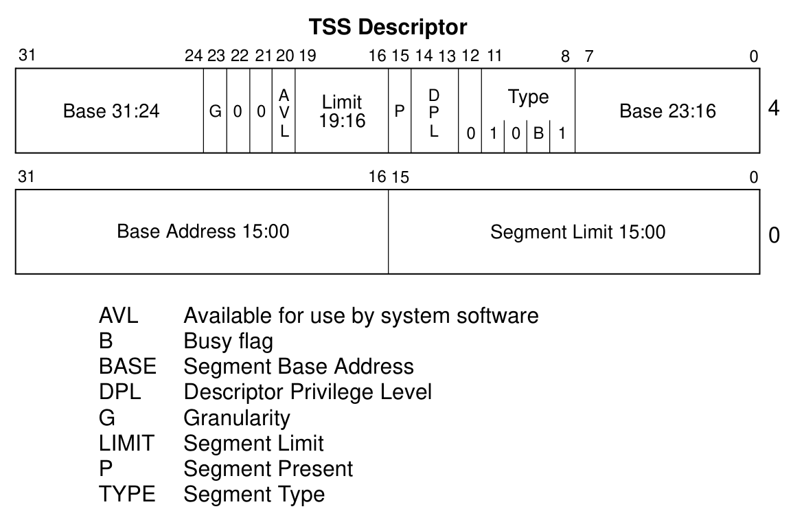

# 保护模式内存管理

## 内存管理概览

> 了解与掌握以下概念，并掌握它们之间的变换：
>
> - 逻辑地址 Logical Address
> - 线性地址 Linear Address
> - 物理地址 Physical Address
>
> 有关**分段管理**的内容一定要掌握，有关分页的内容，我们会在以后的课程中详细介绍。

IA-32架构的内存管理功能分为两部分：**分段**和**分页**。**分段**提供了一种**隔离单个代码、数据和堆栈模块的机制**，以便**多个程序**(或任务)可以**在同一处理器上运行**，而不会相互干扰。**分页**提供了一种用于实现传统的按需分页的**虚拟内存系统**的机制，其中程序的**执行环境**的各部分根据需要**映射到物理存储器中**。分页也可以用于提供多个任务之间的隔离。**在保护模式下**操作时，**必须使用**某种形式的**分段**。没有模式位可以禁用分段。然而，**分页**的使用**是可选的**。

这两种机制(分段和分页)可以被配置以支持使用共享内存的简单单程序(或单任务)系统、多任务系统或多处理器系统。

**分段**提供了一种机制，用于将处理器的可寻址存储器空间(称为**线性地址空间**)**划分为更小的受保护地址空间，称为段**。**段**可用于**保存程序的代码、数据和堆栈**，或用于**保存系统数据结构**(如TSS(任务状态段, Task-state Segment)或LDT(本地/局部描述符表, Local Descriptor Table))。如果**一个处理器上运行多个程序**(或任务)，则可以**为每个程序分配**自己的**一组段**。然后，处理器**强制规定**这些程序段之间的**边界**，并确保一个程序不会通过写入另一个程序的程序段来干扰另一程序的执行。分段机制还允许对段进行分类，从而能限制在特定类型的段上能够执行的操作。

系统中的所有段都包含在处理器的线性地址空间中。要在一个特定的段中找到一个字节，必须提供一个**逻辑地址**(Logical Address)(也称为远指针(Far Pointer))。逻辑地址由**段选择子**和**偏移量**组成。段选择子是段的唯一标识符，它还为提供了描述符表(例如全局描述符表，GDT)的偏移量以定位到段描述符。每个段都有一个段描述符，它指定段的大小、段的访问权限和特权级别、段类型以及段的第一个字节在线性地址空间中的位置(称为段基址)。逻辑地址的偏移量部分和段基址相加以定位段内的字节。因此，**基地址加上偏移量**在处理器的线性地址空间中**形成了一个线性地址**。

如果不使用分页，处理器的线性地址空间直接映射到处理器的物理地址空间。物理地址空间定义为处理器可以在其地址总线上生成的地址范围。

由于多任务计算系统通常**定义一个容量远大于物理内存的线性地址空间**，因此需要某种“虚拟化”线性地址空间的方法。这种线性地址空间的虚拟化是通过处理器的**分页机制**来处理的。

**分页支持**使用**少量物理内存(RAM 和 ROM)和一些磁盘存储**模拟大的线性地址空间的**“虚拟内存”环境**。使用分页时，**每个段被分成若干页**(通常每个大小为 4 KB)，这些页面存储在物理内存或磁盘上。操作系统或执行程序**维护一个页目录和一组页表来跟踪页**。当程序(或任务)试图访问线性地址空间中的地址位置时，处理器使用页目录和页表将线性地址转换为物理地址，然后在该地址上执行请求的操作(读或写)。

如果正在访问的页面当前**不在物理内存中**，则处理器会**中断**程序的执行(通过生成页面错误异常)。然后操作系统或执行程序**将页面从磁盘读入物理内存并继续执行程序**。

当在操作系统或执行程序中正确实现分页时，物理内存和磁盘之间的页面交换对于程序的正确执行是**透明**的。即使是为 16 位 IA32 处理器编写的程序在虚拟 8086 模式下运行时也可以(透明地)分页。

## 分段机制

IA-32架构支持的分段机制可用于实现各种各样的系统设计。这些设计包括从只使用最少的分段来保护程序的**平面模型**(Basic Flat Model)，到使用分段创建能可靠地执行多个程序和任务的稳健操作环境的**多分段模型**(Multi-Segment Model)。

下面几节给出了几个例子，说明如何在系统中使用分段来提高内存管理性能和可靠性。

### Basic Flat Model(基本平面模型)

系统最简单的内存模型是**基本的“平面模型”**(Basic Flat Model)，其中操作系统和应用程序可以访问连续的、未分段的地址空间。这种基本平面模型**在最大程度上**对系统设计者和应用程序员都**隐藏了架构的分段机制**。

要使用 IA-32 架构实现基本的平面内存模型，必须至少创建两个段描述符，一个用于指向代码段，一个用于指向数据段。然而，这两个段都映射到整个线性地址空间：也就是说，这两个段的段描述符具有相同的基地址值`0`和相同的`4GBytes`段界限。通过将段界限设置为`4GBytes`，即使访问的地址没有物理内存，段机制也不会产生“超出内存范围”异常。ROM(EPROM)一般位于物理地址空间的顶部，因为处理器从`FFFF_FFF0H`开始执行。RAM(DRAM)之所以放在地址空间的底部，是因为复位初始化后DS数据段的初始基地址为`0`。

### Protected Flat Model(受保护的平面模型)

受保护平面模型与基本平面模型类似，只是将**段界限设置为仅包括物理内存实际存在的地址范围**(见下方示意图)。尝试访问实际内存范围以外的地址会生成一般保护异常 (`#GP`)。此模型为某些类型的程序错误提供最低级别的硬件保护。

可以向这个受保护的平面模型添加更多的复杂机制以提供更多的保护。例如，为了能在分页
机制中分离普通用户和超级用户的代码和数据，需要定义四个段：用户特权级别 3 的代码和数据段，以及管理员特权级别 0 的代码和数据段。通常这些段都相互重叠并从线性地址空间中的地址 0 开始。这个平面模型加上一个简单的分页结构就可以在操作系统和应用程序之间起到保护作用。而且，如果为每一个进程都分配一个页结构，这样就可以在应用程序之间起到保护作用。几个流行的多任务操作系统使用了类似的设计。

### Multi-Segment Model(多段模型)

**多段模型充分利用了分段机制**，提供了对代码，数据结构，以及程序的硬件级的强制保护。在这里，**每个进程(或者任务)都被分配了自己的段描述符表以及自己的段**。进程可以完全独自拥有这些分配到的段，也可以与其他进程共享这些段。运行在系统上的各个程序对所有段的访问以及对执行环境的访问均由硬件控制。

访问检查机制不仅可以避免对段界限之外的地址进行寻址，也可以避免对特定段执行非法操作。比如，因为代码段被指定为只读的，所以由硬件来防止对代码段写入数据。为段而产生的访问权限信息也可以被用来建立保护级别。保护级别也可以防止操作系统的例程被未授权的应用进程访问。

### 分页与分段

分页机制可以与上文所描述的任何一种段模型配合使用。处理器的分页机制把线性地址空间分成很多页，这些线性地址空间里的页再被映射到物理地址空间上的页。分页机制提供了一些页层次的保护措施，这些措施可以与段保护措施配合或者取代段的保护措施。例如，它允许逐页实施读写保护，还提供可以逐页指定两级(用户级、管理级)保护。

## 逻辑地址和线性地址的转换

> 重点掌握以下内容：
>
> - 段选择子 Segment Selectors
> - 段寄存器 Segment Registers，以及如何加载它们
> - 段描述子 Segment Descriptors，掌握其结构
>
> 掌握以上概念后，思考如何将逻辑地址转换成线性地址的，处理器做了几件事？

### 段选择子

段选择符是一个 16 位的段标识符。它并不直接指向该段，而是指向定义该段的段描述符。一个段选择符包含以下项目：

- `Index`(位 3～15)

  选中 GDT 或 LDT 中 8192 个描述符中的某个描述符。处理器将索引值乘以 8(段描述符的字节数)，然后加上 GDT 或 LDT 的基地址(基地址在`GDTR`或者`LDTR`寄存器中)。

- `TI`(table indicator, 位 2)

  确定使用哪一个描述符表：将这个标记置 0，表示用 GDT。将这个标记置 1，表示用 LDT。

- `RPL`(Requested Privilege Level ,请求的特权级, 位0~1)

  确定该选择符的特权级：特权级从`0`到`3`取值，其中`0`为最高特权级。

**GDT中的第一项**是**不被**处理器**使用**的。指向GDT中第一项的段选择子（即选择符中的索引为 0，`TI`标记置为 0）被视为**空段选择子**。当段寄存器（除了CS 或 SS）被赋值为空选择符时，处理器不产生异常。然而当使用值为空段选择子的段寄存器来访问内存时，处理器会产生一个异常。空段选择子可以用来初始化未使用的段寄存器。对CS或者SS赋予一个空段选择子会导致处理器产生一个通用保护异常 (`#GP`)。

段选择子作为指针变量的一部分对应用程序可见，但段选择子的值通常由链接编辑器或链接加载器分配或修改，而不是应用程序。

### 段寄存器

为了减少地址转换的时间和代码复杂度，**处理器提供了6个段寄存器**来保存段选择子。每个段寄存器都支持某个特定类型的内存寻址（代码，堆栈，数据等等）。实际上，要执行任何类型的程序，至少要将代码段寄存器（`CS`），数据段寄存器（`DS`）和堆栈段寄存器（`SS`）赋予有效的段选择子。处理器还提供了三个额外的数据段寄存器（`ES`、`FS` 和 `GS`），它们可用于为当前正在执行的程序（或任务）提供额外的数据段。

当一个程序**要访问某个段的时候**，段的**段选择子必须已经加载到其中一个段寄存器**中。因此，尽管**一个系统可以定义数千个段**，**但只有6个可以立即使用**。其他段只有在程序执行期间将他们的段选择子置入这些寄存器中时才可以被使用。

每个**段寄存器**都**由可见(Visible)部分和不可见(Hidden)部分**组成。（有时，不可见部分也被称为`descriptor cache`或者`shadow register`）。当**段选择子被加载到**一个段寄存器的**可见部分时**，**处理器**也**从段选择子指向的段描述符中获取基地址、段限制和访问控制信息**，并将它们**加载到段寄存器的隐藏部分**。缓存在段寄存器中的信息（可见的和隐藏的）允许处理器直接转换地址，而无需花费额外的总线周期从段描述符中读取段基址和段界限。在**多个处理器**可以**访问相同描述符表的系统中**，**当描述符表被修改时，软件应重新加载段寄存器**。如果不这样做，在内存驻留版本**被修改后**，缓存在段寄存器中的**旧段描述符可能会再次被使用**。

有两种载入段寄存器的指令：

1. **直接载入指令**，如：`MOV`，`POP`，`LDS`，`LES`，`LSS`，`LGS`和`LFS`。这些指令**明确指定了相应的寄存器**。
2. **隐含的载入指令**，如远指针版的`CALL`、`JMP`、`RET`指令，`SYSENTER`和`SYSEXIT`指令，还有`IRET`、`INTn`、`INTO`和`INT3`指令。这些指令在执行时会捎带改变 `CS` 寄存器（有时还有其他段寄存器）的内容。

`MOV`指令也可用于将段寄存器的可见部分存储到通用寄存器中。

### 段描述符

段描述符是GDT或LDT中的一个数据结构，它为处理器提供诸如段基址，段大小，访问权限及状态等信息。段描述符主要是由编译器，连接器，装载器或者操作系统构造的，而不是由应用程序产生的。

- `Segment limit field`：指定段的大小。
- `Base address fields`：定义段的第0字节在 4 GB 线性地址空间中的位置。
- `Type field `：指明段或者门的类型，确定段的范围权限和增长方向。
- `S (descriptor type) flag`：指定是系统段描述符（清除 S 标志）还是用于代码或数据段描述符（设置 S 标志）。
- `DPL (descriptor privilege level) field`：指定段的特权级别。特权级别的范围可以从 0 到 3，其中 0 是最高特权级别。
- `P (segment-present) flag`：指示段是否存在于内存中（1表示在内存中，0表示不在）。当指向对应段的段描述符的段选择子被加载到段寄存器中时，如果此标志为0，处理器将生成段不存在异常 (`#NP`)。
- `D/B (default operation size/default stack pointer size and/or upper bound) flag`：**根据当前段描述符指向**的是可执行代码段、向下扩展数据段还是堆栈段来**实现不同的功能**。 （对于 32 位代码和数据段，此标志应始终设置为 1，对于 16 位代码和数据段，应始终设置为 0。）
  - 如果当前段描述符指向的是**可执行代码段**：该标志称为`D`标志，它指示段中指令引用的**有效地址和操作数的默认位数**。如果置1，则默认为 32 位地址和 32 位或 8 位操作数；如果清0，则默认为 16 位地址和 16 位或 8 位操作数。
  - 如果当前段描述符指向的是**堆栈段**(`SS`寄存器指向的数据段)：该标志称为 `B`（大）标志，它**指定**用于隐式堆栈操作（例如压入、弹出和调用）的**堆栈指针的大小**。如果该标志为1，则使用一个32位的堆栈指针，存储在32位的ESP寄存器中；如果该标志为0，则使用一个 16 位堆栈指针，它存储在 16 位 SP 寄存器中。如果堆栈段设置为向下扩展的数据段，B标志还确定了该堆栈段的地址上界。
  - 如果当前段描述符指向的是**向下扩展的数据段**：这个标志称为`B`标志，它确定了该段的地址上界。如果该标志为1，段地址上界为`FFFFFFFFH`（4GB）；若该标志为0，段地址上界为`FFFFH`（64KB）。
- `G (granularity) flag`：确定段界限扩展的增量。当G标志为0，段界限以字节为单位；G标志为1，段界限以4KB为单位。（这个标志不影响段基址的粒度，段基址的粒度永远是字节）如果G标志为1，那么当检测偏移量是否超越段限长时，不用测试偏移量的低12位。例如，如果G标志为1，0段限长意味着有效偏移量为从0到4095。
- `L (64-bit code segment) flag`：IA32-e模式特有的标志。
- `Available and reserved bits`：段描述符的第二个双字的第 20 位可供系统软件使用。

关于`Type`字段，作如下补充：

### 将逻辑地址转换为线性地址

处理器通过如下几个步骤将逻辑地址转换为线性地址：

1. 通过段选择符中的偏移量，在GDT或者LDT中定位该段的段描述符。(仅当一个新的段选择符被读入段寄存器时才执行这一步)
2. 检查段描述符中的访问权限和段的地址范围以确保该段是可访问的，偏移量是在段限长范围内的。
3. 将段描述符中的段基址与偏移量相加以构成线性地址。

## 描述符的分类

> 重点掌握有关描述符以下内容：
>
> - 数据段描述符 Data segment Descriptor
> - 代码段描述符 Code segment Descriptor
> - 局部描述符表描述符 Local descriptor-table (LDT) segment descriptor
> - 任务状态段描述符 Task-state segment (TSS) descriptor
> - 调用门描述符 Call-gate descriptor
> - 中断门描述符 Interrupt-gate descriptor
> - 陷阱门描述符 Trap-gate descriptor
> - 任务门描述符 Task-gate descriptor

### 数据段和代码段描述符

当段描述符中的 S（描述符类型）标志被置1时，说明这是代码段或数据段的段描述符。类型字段的最高位（段描述符的第二个双字的第 11 位）确定这个段描述符是用于数据段（清0）还是代码段（置1）。

### 系统段描述符

当段描述符中的 S（描述符类型）标志被清0时，描述符类型是系统描述符。处理器识别以下类型的系统描述符：局部描述符表描述符 Local descriptor-table (LDT) segment descriptor、任务状态段描述符 Task-state segment (TSS) descriptor、调用门描述符 Call-gate descriptor、中断门描述符 Interrupt-gate descriptor、陷阱门描述符 Trap-gate descriptor、任务门描述符 Task-gate descriptor。

这些描述符又可以分为两类：系统段描述符和门描述符。系统段描述符指向系统段（LDT和TSS段）。门描述符它们自身就是“门“，它们或者持有指向代码段过程入口点的指针，或者持有TSS（任务门）的段选择子。

#### 局部描述符表描述符

> Local descriptor-table (LDT) segment descriptor, P87, 3.5 SYSTEM DESCRIPTOR TYPES

LDT位于LDT类型的系统段中。GDT必须包含LDT段的段描述符。如果系统支持多个LDT，则每个LDT必须在GDT中有一个单独的段选择器和段描述符。LDT的段描述符可以位于GDT中的任何位置。有关LDT段描述符类型的信息，请参见第3.5节“系统描述符类型”。

LDT通过其段选择子进行访问。为了在访问LDT时消除地址转换，LDT的段选择器、基本线性地址、限制和访问权限存储在LDTR寄存器中（请参阅第2.4节“内存管理寄存器”）。

#### 任务状态段描述符

> TSS Descriptor, 手册P227

与所有其他段一样，TSS 由**TSS段描述符**定义。 TSS 段描述符**只能放在 GDT 中**；它们不能放在 LDT 或 IDT 中。

尝试使用设置了 TI 标志（指示当前 LDT）的段选择子访问 TSS 会导致在 CALL 和 JMP 期间生成一般保护异常（#GP）；它会在 IRET 期间导致无效的 TSS 异常 (#TS)。如果尝试将 TSS 的段选择子加载到段寄存器中，也会生成一般保护异常。

类型字段中的忙标志（B）指示任务是否忙。忙任务是指当前正在运行或挂起的任务。类型字段值为 1001B 的表示非活动任务；值 1011B 表示任务繁忙。任务不是递归的。处理器使用忙标志来检测调用一个被中断任务的尝试。为了确保只有一个忙标志与任务相关联，每个 TSS 应该只有一个指向它的 TSS 描述符。

任何可以访问 TSS 描述符的程序或过程（即，其 CPL 在数值上等于或小于 TSS 描述符的 DPL）都可以通过调用或跳转来分派任务。

在大多数系统中，TSS 描述符的 DPL 被设置为小于 3 的值，因此只有特权软件才能执行任务切换。但是，在多任务应用程序中，某些 TSS 描述符的 DPL 可能会设置为 3，以允许在应用程序（或用户）特权级别进行任务切换。

#### 调用门描述符

> Call-gate descriptor, 手册P149

调用门为不同特权级间的进程控制转换提供了便利。它们一般只用在操作系统中或者使用特权级保护机制的程序里。调用门也可用于 16bit 和 32bit 代码段之间的进程控制转换，就如 17.4 节 中所描述的。

调用门描述符可以存在于GDT或LDT中，但不存在于中断描述符表（IDT）中。它执行六项功能：

- 它指定要访问的代码段；
- 它为指定代码段中的过程定义了一个入口点；
- 它指定调用方尝试访问过程所需的特权级别；
- 如果发生堆栈切换，它会指定要在堆栈之间复制的可选参数的数量；
- 它定义了要推送到目标堆栈上的值的大小：16位门强制16位推送，32位门强制32位推送；
- 它指定调用门描述符是否有效。

#### 中断门描述符&陷阱门描述符

> Interrupt-gate descriptor & Trap-gate descriptor, 手册P180, 6.11 IDT DESCRIPTORS

中断门和陷阱门同调用门（见第5.8.3节“调用门”）非常相似。它们包含一个远指针（段选择器和偏移量），处理器使用该指针将程序执行转移到异常或中断处理程序代码段中的处理程序过程。这些门的不同之处在于处理器处理EFLAGS寄存器中IF标志的方式（参见第6.12.1.2节“异常或中断处理程序使用标志”）。

#### 任务门描述符

> Task-gate descriptor, 手册P180, 6.11 IDT DESCRIPTORS;手册P230, 7.2.5 Task-Gate Descriptor

IDT中使用的任务门的格式与GDT或LDT中的任务门格式相同（见第7.2.5节，“任务门描述符”）。任务门包含异常和/或中断处理程序任务的TSS的段选择子。

任务门描述符提供了对任务的间接、受保护的引用。它可以放置在GDT、LDT或IDT中。任务门描述符中的TSS段选择子字段指向GDT中的TSS描述符，段选择子中的`RPL`未使用。

任务门描述符的DPL控制在任务切换期间对TSS描述符的访问。当程序或过程通过任务门调用或跳转到任务时，指向任务门的门选择子的`CPL`和`RPL`字段必须小于或等于任务门描述符的`DPL`。请注意，当使用任务门时，目标TSS描述符的`DPL`不被使用。

