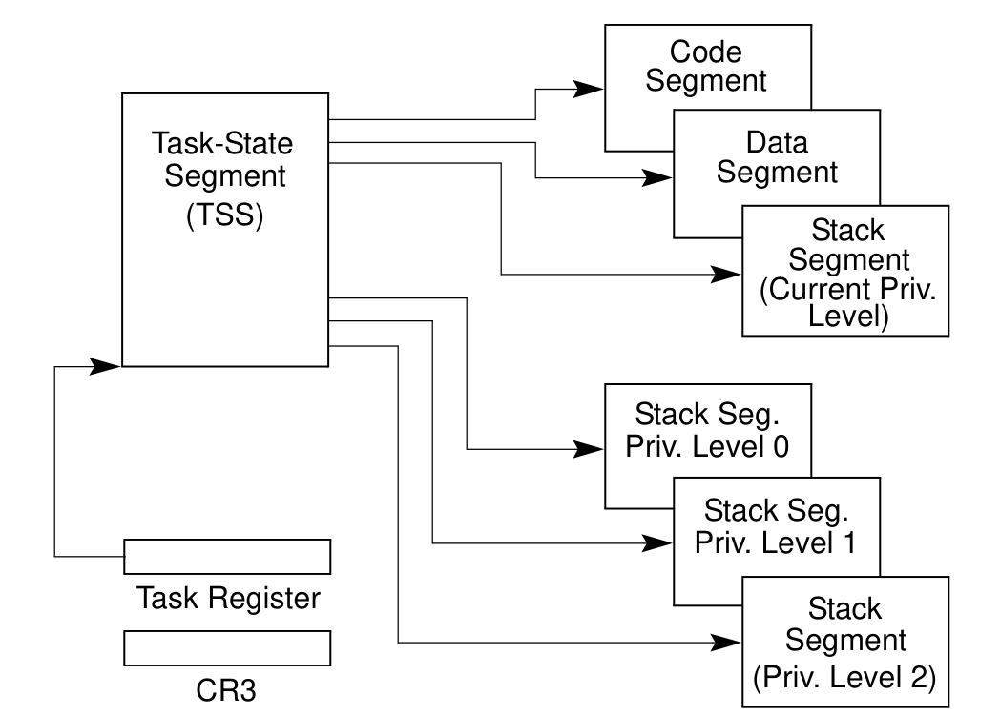
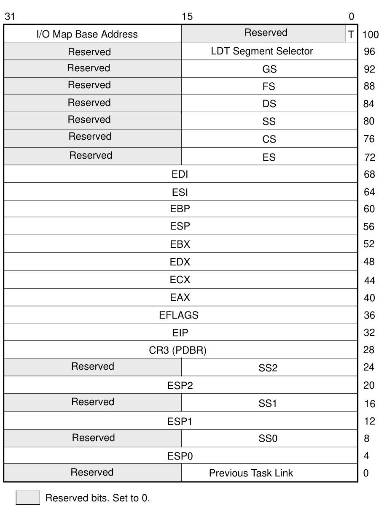
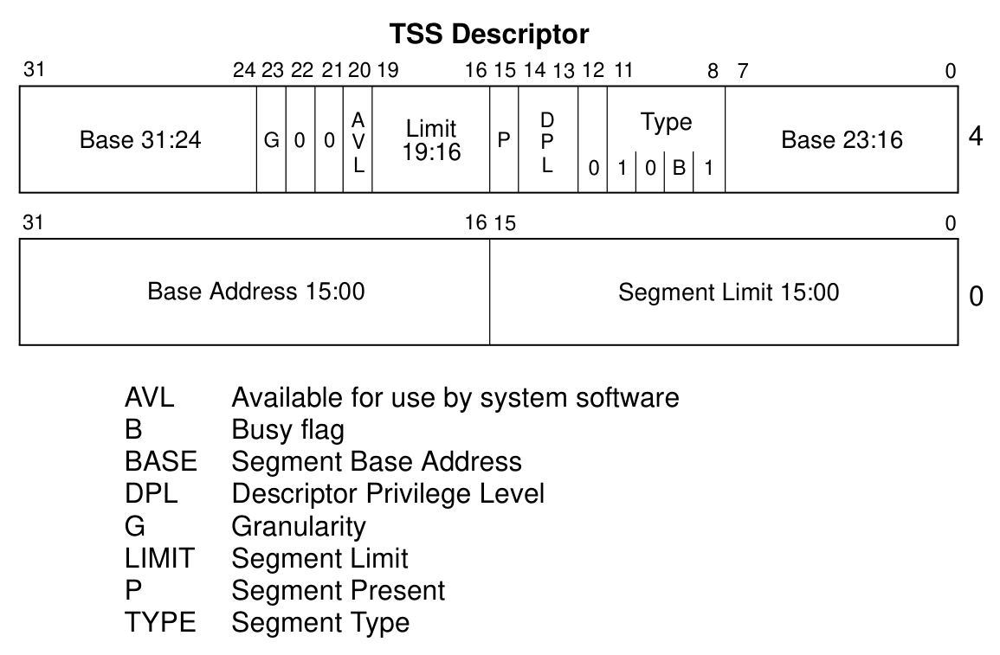
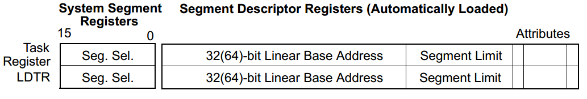
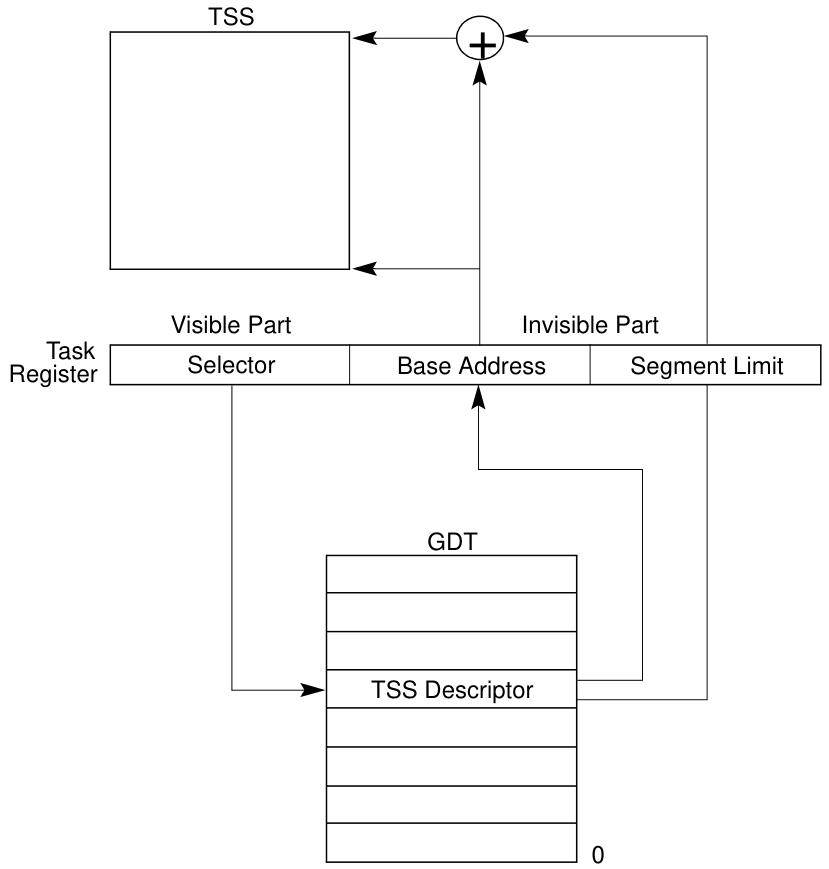
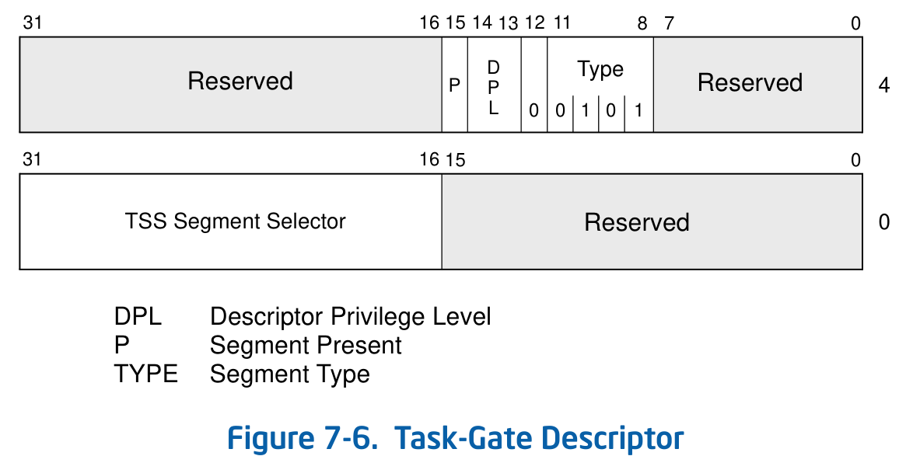
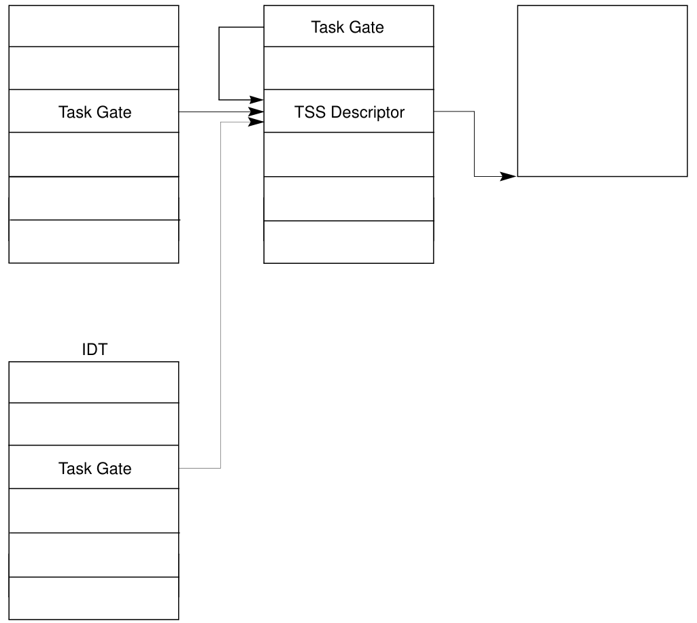
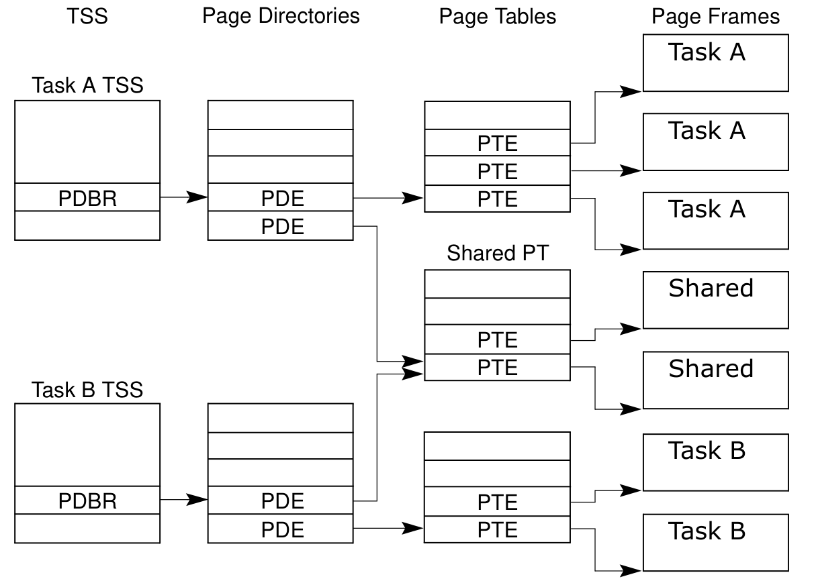

# 任务管理

## 任务管理概述

#### 什么是任务？

**任务**是处理器可以调度、执行和挂起的**工作单元**。它可以**用于**执行程序、任务或进程、操作系统服务实用程序、中断或异常处理程序、内核或执行实用程序。

IA-32体系结构提供了一种保存任务状态、调度任务以供执行以及从一个任务切换到另一个任务的机制。在**保护模式下**操作时，**所有处理器的执行都在任务中进行**。即使是简单的系统也必须定义至少一个任务。更复杂的系统可以使用处理器的任务管理机制来支持多任务应用程序。

#### `80x86` 提供了哪些硬件支持？

- 任务状态段(TSS)
- TSS描述符
- 任务寄存器(TR)
- 任务门
- 任务链
- ...

#### 描述符表中与任务相关的描述符有哪些？

- TSS段描述符
- 任务门描述符
- ...

#### 任务切换与过程调用的区别是什么？

> 注：本小节内容源自ChatGPT，仅供参考

任务切换与过程调用有以下几点区别：

1. 目的不同。任务切换是为了让多个任务在同一时间内共享处理器资源，从而提高处理效率；而过程调用是在同一任务中的不同函数间进行调用，目的是为了完成特定的功能。

2. 触发条件不同。任务切换是由操作系统内核进行调度和切换的，触发条件一般是当前任务的时间片用完或者发生了某些中断事件；而过程调用是由程序员在代码中主动进行的，通过指令调用实现。

3. 上下文切换不同。任务切换涉及到需要保存和恢复任务的上下文信息，包括处理器寄存器、程序计数器、堆栈等；而过程调用只需要保存和恢复当前函数的信息，一般只需要保存和恢复寄存器和堆栈中的关键信息。

4. 处理器状态不同。任务切换时需要切换处理器的运行状态和特权级，而过程调用时保持当前运行状态和特权级不变。

总之，任务切换和过程调用是两种不同的操作，目的和实现方式都有所不同。在操作系统内核的实现和程序开发中，需要根据具体的场景选择合适的方式。

### 任务的结构

- 一个任务由几部分构成？

任务由两部分组成：**任务执行空间**和**任务状态段（TSS）**。

**TSS指定组成任务执行空间的段**，并为**任务状态信息**提供存储位置。在多任务系统中，TSS还提供了一种用于链接任务(`linking tasks`)的机制。

任务由其TSS的段选择子标识。当任务被加载到处理器中执行时，TSS的段选择子、基地址、段界限和段描述符属性被加载到任务寄存器中。

如果对任务执行**分页**，则将任务使用的**页目录的基地址**加载到**控制寄存器`CR3`**中。

- 任务执行空间包括什么？

**任务执行空间**由一个**代码段**、一个**堆栈段**和一个或多个**数据段**组成（见下图）。

- 为什么会有多个特权级栈空间？

如果操作系统或执行程序使用处理器的特权级别**保护**机制，则任务执行空间还为**每个**特权级别**提供单独的堆栈**。

### 任务状态

#### 当前正在执行的任务状态包括哪些内容？

以下项目定义了当前正在执行的任务的状态：

- 任务的当前执行空间，由段寄存器（`CS`、`DS`、`SS`、`ES`、`FS`和`GS`）中的段选择子定义；
- 通用寄存器的状态；
- `EFLAGS`寄存器的状态；
- `EIP`寄存器的状态；
- 控制寄存器`CR3`的状态；
- 任务寄存器的状态；
- LDTR寄存器的状态；
- I/O映射基地址和I/O映射（包含在TSS中）；
- 指向特权0、1和2堆栈（包含在TSS中）的堆栈指针；
- 链接到以前执行的任务（包含在TSS中）；

在调度任务之前，除任务寄存器的状态外，所有这些项都包含在任务的TSS中；此外，LDTR寄存器的完整内容不包含在TSS中，只包含在LDT的段选择器中。

#### 掌握每一个被包含内容的含义？

各个寄存器的含义已在前三次读书笔记中整理，此处不再赘述: )

#### 为什么要包含这些内容？

为了在任务“回来”时，能够恢复到任务被打断的时的状态。

### 任务的执行

#### 任务的执行方式有几种？

软件或处理器可以通过以下方式之一调度任务以供执行：

(1) 使用`CALL`指令对任务的显式调用；

(2) 使用`JMP`指令显式跳转到任务；

(3) （处理器）对中断处理程序任务的隐式调用；

(4) 对异常处理程序任务的隐式调用；

(5) 当`EFLAGS`寄存器中的NT标志被置1时的返回（由`IRET`指令启动）。

所有这些用于调度任务的方法都**使用**指向任务门或任务TSS的**段选择子**来**标识要调度的任务**。当**使用`CALL`或`JMP`指令调度任务时**，指令中的**选择子可以直接选择TSS**，**也可以选择**用于保存TSS选择器的**任务门**。当**调度任务以处理中断或异常时**，中断或异常的IDT条目必须包含一个任务门，该任务门包含中断或异常处理程序TSS的选择子。

当**任务被调度**执行时，在当前运行的任务和调度的任务之间会发生**任务切换**。在任务切换期间，当前正在执行的任务的执行环境（称为任务的状态或**上下文**）**保存在其TSS中**，并**暂停任务的执行**。然后将调度任务的上下文加载到处理器中，并从新加载的EIP寄存器指向的指令开始执行该任务。如果自上次初始化系统以来，任务尚未运行，则`EIP`将指向任务代码的第一条指令；否则，它将指向任务上次活动时执行的最后一条指令之后的下一条指令。

> 备注：在“中断和异常处理”部分，当时是说如果特权级和中断程序一致，不会发生任务切换。

如果当前正在执行的任务（调用任务 the calling task）调用了被调度的任务（被调用任务 the called task），则**调用任务(the calling task)的TSS段选择子存储在被调用任务(the called task)的TSS中**，以提供返回调用任务(the calling task)的链接。

中断和异常可以通过任务切换到处理程序任务来处理。这里，处理器执行任务切换以处理中断或异常，并在从中断处理程序任务或异常处理程序任务返回时自动切换回被中断的任务。该机制还可以处理在中断任务期间发生的中断。

作为任务切换的一部分，处理器还可以切换到另一个LDT，允许每个任务具有不同的基于LDT的段的逻辑到物理地址映射。页面目录基寄存器（`CR3`）也在任务交换机上重新加载，允许每个任务都有自己的一组页面表。这些保护设施有助于隔离任务并防止它们相互干扰。

如果不使用保护机制，则处理器在任务之间不提供保护。即使使用多个权限级别进行保护的操作系统也是如此。如果以特权级别3运行的任务与其他特权级别3的任务使用相同的LDT和页表，该任务可能会访问代码并损坏数据和其他任务的堆栈。

使用任务管理机制来处理多任务应用程序是可选的。多任务处理可以在软件中进行，每个软件定义的任务都在单个IA-32架构的任务上下文中执行。

- 熟悉掌握每一种执行方式的过程
- `Linux 0.00` 用的是哪种方式？

#### 任务可以递归调用吗？为什么？

对于所有IA-32处理器，任务**都不是递归**的。任务**不能调用或跳转到自身**。

如果允许递归调用，则需要为每次递归调用记录信息。但是一个任务只有一个TSS，无法记录下来“每次”的信息。如果需要递归调用，可以为每个过程单独开一个TSS。

## 任务的数据结构

### 任务状态段 Task-State Segment (TSS)

恢复任务所需的处理器状态信息保存在称为**任务状态段**（TSS）的系统段中。下图显示了为32位CPU设计的任务的TSS格式。TSS的字段分为两大类：动态字段和静态字段。

当任务**在任务切换期间**暂停时，处理器会**更新动态字段**。以下是动态字段：

- **通用寄存器字段**：任务切换之前`EAX`、`ECX`、`EDX`、`EBX`、`ESP`、`EBP`、`ESI`和`EDI`寄存器的状态；
- **段选择子字段**：任务切换前存储在`ES`、`CS`、`SS`、`DS`、`FS`和`GS`寄存器中的段选择子；
- **`EFLAGS`寄存器字段**：任务切换前`EFLAGS`寄存器的状态；
- **`EIP`（指令指针）字段**：任务切换前EIP寄存器的状态；
- **上一任务链接字段**：包含上一任务TSS的段选择子（在由调用、中断或异常引起的任务切换时更新）。此字段（有时称为反向链接字段(back link field)）允许使用`IRET`指令将任务切换回前一任务。

处理器读取**静态字段**，但**通常不会更改它们**。这些字段是在创建任务时设置的。以下是静态字段：

- **LDT段选择子字段**：包含任务的LDT的段选择子；

- **`CR3`控制寄存器字段**：包含任务要使用的**页目录的基地址**。控制寄存器`CR3`也被称为页目录基寄存器（PDBR）；

- **特权级别0、1、2的堆栈指针字段**：这些堆栈指针由逻辑地址组成，该逻辑地址由堆栈段（`SS0`、`SS1`和`SS2`）的段选择子和堆栈中的偏移量（`ESP0`、`ESP1`和`ESP2`）组成。请注意，对于特定任务，这些字段中的值是**静态**的；而如果在任务内发生**堆栈切换**，**则`SS`和`ESP`值将改变**；

- **T（debug trap）标志**（字节100，位0）：设置后，当任务**切换到此任务时**，T标志会导致处理器**引发调试异常**（请参阅第17.3.1.5节“任务切换异常条件”）。

- **I/O映射基地址字段**：(注：不知道`bitmap`在x86中的含义，这里先翻译成位图了，感觉怪怪的)包含从TSS底部到I/O权限位图和中断重定向位图的16位偏移量。当存在时，这些映射存储在TSS中较高的地址。

  I/O映射基地址指向I/O许可位图的开始和中断重定向位图的结束。

### `TSS` 描述符

> TSS Descriptor, 手册P227

与所有其他段一样，TSS 由**TSS段描述符**定义。 TSS 段描述符**只能放在 GDT 中**；它们不能放在 LDT 或 IDT 中。

尝试使用`TI`标志（指示当前 LDT）为1的段选择子访问 TSS 会导致在 `CALL` 和 `JMP` 期间生成一般保护异常（`#GP`）；若是在 `IRET` 期间会导致无效的 TSS 异常 (`#TS`)。如果尝试将 TSS 的段选择子加载到段寄存器中，也会生成一般保护异常。

类型字段中的忙标志（B）指示任务是否忙。忙任务是指当前正在运行或挂起的任务。类型字段值为 `1001B` 的表示非活动任务；值 `1011B` 表示任务繁忙。任务不是递归的。处理器使用忙标志来检测对被中断任务的调用尝试。为了确保只有一个忙标志与任务相关联，每个 TSS 应该只有一个指向它的 TSS 描述符。

`base`、`limit` 和 `DPL` 字段以及 `granularity` 和 `present` 标志的功能类似于它们在数据段描述符中的使用（请参阅第 3.4.5 节，“段描述符”）。当 32 位 TSS 的 TSS 描述符中的 G 标志为 0 时，段界限的值必须等于或大于 `67H`，比 TSS 的最小大小小一个字节。尝试切换到一个对应TSS段界限小于 `67H`的任务会生成无效 TSS 异常 (`#TS`)。如果包含 I/O 权限位图或操作系统存储额外数据，则需要更大的段界限。处理器不会在任务切换时检查段界限是否大于 67H ；但是，它会在访问 I/O 权限位图或中断重定向位图时进行检查。

任何可以访问 TSS 描述符的程序或过程（即，其 `CPL` 在数值上等于或小于 TSS 描述符的 DPL）都可以通过调用或跳转来分派任务。

在大多数系统中，TSS 描述符的 DPL 被设置为小于 3 的值，因此只有特权软件才能执行任务切换。但是，在多任务应用程序中，某些 TSS 描述符的 DPL 可能会设置为 3，以允许在应用程序（或用户）特权级别进行任务切换。

### 任务寄存器

**任务寄存器**保存**当前任务**的 TSS 的 **16 位段选择子**和**整个段描述符**（32 位基地址、16 位段限制和描述符属性），如下图所示。**段描述符是从当前任务的 GDT 中的 TSS 描述符**复制而来的。图 7-5 显示了处理器用来访问 TSS 的路径（使用任务寄存器中的信息）。

任务寄存器有可见部分（可以通过软件读取和更改）和不可见部分（由处理器维护，软件无法访问）。可见部分的段选择子指向 GDT 中的一个 TSS 描述符。处理器使用任务寄存器的不可见部分来缓存 TSS 的段描述符。将这些值缓存在寄存器中可以提高任务的执行效率。 `LTR`（加载任务寄存器）和`STR`（存储任务寄存器）指令加载和读取任务寄存器的可见部分：

- `LTR` 指令将指向 GDT 中的 TSS 描述符的段选择子（源操作数）加载到任务寄存器中。然后它使用来自 TSS 描述符的信息加载任务寄存器的不可见部分。 `LTR` 是一条特权指令，只有在 CPL 为 0 时才能执行。它在系统初始化期间用于将初始值放入任务寄存器中。之后，当发生任务切换时，任务寄存器的内容会被隐式更改。
- `STR`（存储任务寄存器）指令将任务寄存器的可见部分存储在通用寄存器或内存中。该指令可以由以任何特权级别运行的代码执行，以识别当前正在运行的任务。但是，它通常仅由操作系统软件使用。

在处理器上电或复位时，段选择子和基地址被设置为默认值 0；段界限设置为 `FFFFH`。

下图显示了处理器用来访问 TSS 的过程（使用任务寄存器中的信息）：

### 任务门描述符 Task-Gate Descriptor

IDT中使用的任务门的格式与GDT或LDT中的任务门格式相同（见第7.2.5节，“任务门描述符”）。任务门包含异常和/或中断处理程序任务的TSS的段选择子。

**任务门描述符**提供了**对任务的间接、受保护的引用**。它可以放置在GDT、LDT或IDT中。任务门描述符中的TSS段选择子字段指向GDT中的TSS描述符，段选择子中的`RPL`未使用。

任务门描述符的DPL控制在任务切换期间对TSS描述符的访问。当程序或过程通过任务门调用或跳转到任务时，指向任务门的门选择子的`CPL`和`RPL`字段必须小于或等于任务门描述符的`DPL`。请注意，**当使用任务门时，不会使用目标 TSS 描述符的 DPL**。

可以通过任务门描述符或 TSS 描述符访问任务。这两种结构都满足以下需求：

- **一个任务只有一个忙标志**：因为任务的忙标志存储在 TSS 描述符中，所以每个任务应该只有一个 TSS 描述符。但是，可能有多个任务门引用相同的 TSS 描述符。
- **提供对任务的选择性访问**：任务门满足了这种需求，因为它们可以驻留在 LDT 中并且可以具有不同于 TSS 描述符的 DPL 的 DPL。没有足够权限访问 GDT（通常 DPL 为 0）中任务的 TSS 描述符的程序或过程可能被允许通过具有更高 DPL 的任务门访问该任务。任务门为操作系统提供了更大的自由度来限制对特定任务的访问。
- **由独立任务处理中断或异常**：任务门也可能驻留在 IDT 中，它允许中断和异常由处理程序任务处理。当中断或异常向量指向任务门时，处理器切换到指定的任务。

下图说明了 LDT 中的任务门、GDT 中的任务门和 IDT 中的任务门如何都指向同一个任务：

## 任务切换

此部分内容重点掌握：

### 什么时候发生任务切换？

在以下四种情况之一中，处理器将执行转移到另一个任务：

- 当前程序、任务或过程**对 GDT 中的 *TSS 描述符*执行 `JMP` 或 `CALL` 指令**；
- 当前程序、任务或过程**对 GDT 或当前 LDT 中的*任务门描述符*执行 `JMP` 或 `CALL` 指令**。
- **指向 IDT 中的任务门描述符的中断或异常向量**；
- 当前任务在 EFLAGS 寄存器中的 **`NT` 标志为1时执行 `IRET`**。

`JMP`、`CALL` 和 `IRET` 指令以及中断和异常都是重定向程序的机制。 （调用或跳转到任务时）对TSS描述符或任务门的引用或（执行 IRET 指令时）`NT` 标志的状态决定是否发生任务切换。

### 发生任务切换时，处理器会执行哪些操作？

处理器在切换到新任务时执行以下操作：

1. 从任务门或先前的任务链接字段（对于使用 `IRET` 指令启动的任务切换），**获取新任务的 TSS 段选择子作为 `JMP` 或 `CALL` 指令的操作数**。
2. **检查是否允许当前（旧）任务切换到新任务**。数据访问权限规则适用于 `JMP` 和 `CALL` 指令。当前（旧）任务的 **CPL** 和新任务的段选择子的 **RPL** 必须**小于或等于**被引用的 **TSS 描述符或任务门的 DPL**。
3. 检查新任务的 TSS 描述符是否为1并且具有有效段界限（大于或等于 `67H`）。
4. **检查新任务是否可用**（调用、跳转、异常或中断）**或忙**（`IRET` 返回）。
5. 检查任务切换中使用的当前（旧）TSS、新 TSS 和所有段描述符是否已分页到系统内存中。
6. 如果任务切换是用 `JMP` 或 `IRET` 指令启动的，处理器会清除当前（旧）任务的 TSS 描述符中的忙（B）标志；如果使用 `CALL` 指令、异常或中断启动：busy (B) 标志保持设置(be left set，所以究竟是设置还是不设置？)。
7. 如果任务切换是用 `IRET` 指令启动的，处理器会清除 `EFLAGS` 寄存器临时保存映像中的 `NT` 标志；如果使用 `CALL` 或 `JMP` 指令、异常或中断启动，则保存的 `EFLAGS` 映像中的 `NT` 标志将保持不变。
8. **在当前（旧）任务的 TSS 中保存当前（旧）任务的状态**。处理器在任务寄存器中找到当前TSS的基地址，然后将以下寄存器的状态复制到旧任务的TSS中：所有通用寄存器，来自段寄存器的段选择器，EFLAGS寄存器的临时保存映像和指令指针寄存器 (`EIP`)。
9. 如果任务切换是通过 `CALL` 指令、异常或中断启动的，处理器在从新任务加载的 EFLAGS 中将 `NT` 标志置1。如果用 `IRET` 指令或 `JMP` 指令启动，`NT` 标志反应(reflect)从新任务加载的 EFLAGS 中 `NT` 的状态(意思是不改变NT标志呗)。
10. 如果任务切换是通过 `CALL` 指令、`JMP` 指令、异常或中断启动的，则处理器会在新任务的 `TSS` 描述符中设置忙 (B) 标志；如果使用 `IRET` 指令启动，则忙 (B) 标志保持设置状态(be left set)。
11. 使用新任务的 TSS 的段选择器和描述符加载任务寄存器。
12. TSS 状态被加载到处理器中。这包括 `LDTR` 寄存器、`PDBR`（控制寄存器 `CR3`）、`EFLAGS` 寄存器、`EIP` 寄存器、通用寄存器和段选择器。
13. 加载并限定(qualified)与段选择子关联的描述符。与此加载和限定(qualified)相关的任何错误都发生在新任务的上下文中，并且可能会破坏体系结构状态。
14. 开始执行新任务。 （对于异常处理程序，新任务的第一条指令似乎尚未执行。）

### 中断或异常向量指向 `IDT` 表中的中断门或陷阱门，会发生任务切换吗？

答：理论上不会。从上面“什么时候发生任务切换”部分可知，只有对**任务门**的调用会发生任务切换。根据前面做的读书报告，如果是中断门或陷阱门被调用，那么可能会发生堆栈切换。

## 任务链

### 如何判断任务是否嵌套？

TSS 的前一个任务链接字段（有时称为“反向链接”）和 EFLAGS 寄存器中的 `NT` 标志用于将执行返回到前一个任务。 `EFLAGS.NT = 1` 表示当前执行的任务嵌套在另一个任务的执行中。

### 什么情况会发生任务嵌套？

当**`CALL`指令、中断或异常导致任务切换**时：处理器将当前TSS的段选择符复制到新任务的TSS的前一个任务链接域；然后它设置 `EFLAGS.NT` = 1。

当 **`JMP` 指令导致任务切换时，新任务不会嵌套**。未使用先前的任务链接字段且 `EFLAGS.NT = 0`。当不需要嵌套时，使用 `JMP` 指令分派新任务。

### 任务嵌套时修改了哪些标志位？

修改了`EFLAGS`中的`NT`标志位。

### 任务嵌套时，如何返回前一任务？

如果软件使用 `IRET` 指令暂停新任务，处理器检查 `EFLAGS.NT = 1`；然后它使用当前任务TSS中上一个任务链接字段中的值返回到上一个任务。

## 任务地址空间

### 什么是任务地址空间？

**任务的地址空间由任务可以访问的段组成**。

### 任务地址空间包括什么？

这些段包括 **TSS 中引用的代码、数据、堆栈和系统段以及任务代码可以访问的任何其他段**。这些段被映射到处理器的线性地址空间，而线性地址空间又被映射到处理器的物理地址空间（直接或通过分页）。

TSS 中的 `LDT` 段字段可用于为每个任务提供其自己的 `LDT`。为任务提供自己的 LDT 允许将自己的任务地址空间与其他任务隔离（通过将与任务关联的所有段的段描述符放置在自己的 LDT 中）。

多个任务也可以使用相同的 LDT。这是一种内存高效的方式，允许特定任务相互通信或控制，而不会降低整个系统的保护屏障。

因为所有任务都可以访问 GDT，所以也可以通过GDT中的段描述符创建访问的共享段。

如果启用分页，则 TSS 中的 CR3 寄存器 (PDBR) 字段允许每个任务拥有自己的一组页表，用于将线性地址映射到物理地址。或者，多个任务可以共享同一组页表。

### 了解把任务映射到线性和物理地址空间的方法？

可以通过以下两种方式之一将任务映射到线性地址空间和物理地址空间：

- **所有任务共享一个从线性到物理地址空间的映射关系**。当未启用分页时，这是唯一的选择。在没有分页的情况下，所有线性地址都映射到相同的物理地址。当启用分页时，这种形式的从线性到物理地址空间映射是通过对所有任务使用一个页目录来获得的。如果支持请求分页虚拟内存，线性地址空间可能会超过可用的物理空间。
- **每个任务都有自己的**被映射到物理地址空间的**线性地址空间**。这种映射形式是通过为每个任务使用不同的页面目录来实现的。因为PDBR（控制寄存器CR3）加载在任务开关上，每个任务可能有不同的页目录。

不同任务的线性地址空间可能映射到完全不同的物理地址。如果不同页目录的条目指向不同的页表，而页表又指向物理内存的不同页，则任务不共享物理地址。

无论使用哪种映射任务线性地址空间的方法，**所有任务的 TSS 都必须位于物理空间的共享区域中，所有任务都可以访问该区域**。此映射是必需的，以便在任务切换期间处理器正在读取和更新 TSS 时，TSS 地址的映射不会更改。 GDT映射的线性地址空间也应该映射到物理空间的共享区域；否则，GDT 的目的就落空了。下图显示了两个任务的线性地址空间如何通过共享页表在物理空间中重叠。

### 了解任务逻辑地址空间，及如何在任务之间共享数据的方法？

要允许在任务之间共享数据，请使用以下技术为数据段创建共享的逻辑到物理地址空间映射：

- **通过 GDT 中的段描述符**：所有任务都一定能够访问 GDT 中的段描述符。如果 GDT 中的某些段描述符指向线性地址空间中的段，这些段映射到所有任务共有的物理地址空间区域，那么所有任务都可以共享这些段中的数据和代码。
- **通过共享 LDT**：如果 TSS 中的 LDT 字段指向相同的 LDT，则两个或多个任务可以使用相同的 LDT。如果共享 LDT 中的某些段描述符指向映射到物理地址空间公共区域的段，则这些段中的数据和代码可以在使用相同LDT的任务之间共享。这种共享方法比通过GDT共享更具选择性，因为共享可以限于特定任务。系统中的其他任务可能有不同的 LDT，这些 LDT 不允许它们访问共享段。
- **通过不同 LDT 中的映射到线性地址空间中公共地址的段描述符**：如果线性地址空间的这个公共区域映射到每个任务的物理地址空间的相同区域，这些段描述符允许任务共享段。这样的段描述符通常称为别名。这种共享方法比上面列出的方法更具选择性，因为 LDT 中的其他段描述符可能指向不共享的独立线性地址。