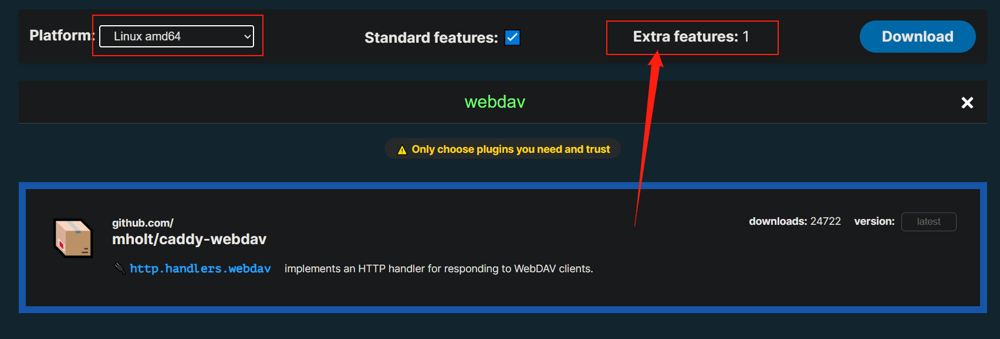
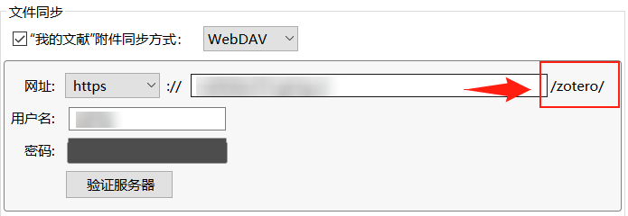
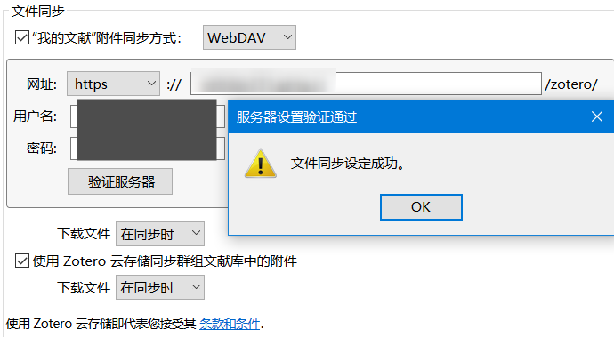

Zotero支持WebDAV模式，而本人有多台设备，有同步的需求。想起来手头还有一些吃灰的机器，拿出来跑一下WebDAV好了。

查找了一些方案，有基于Apache、Nginx、Caddy的，也有单独一个二进制解决所有问题的。一直想玩玩Caddy但没时间，趁这段时间闲一些，折腾折腾得了。

## 下载二进制

进入官方下载页面，选择平台、架构后，搜索`webdav`插件并选中，此时`Extra features`会变成1。然后将其下载下来。



## 编写Caddyfile

我们需要一个配置文件来配置Caddy，这个文件对于Nginx来说是`*.conf`文件，对于Caddy来说就是Caddyfile。Caddyfile有自己的一套简洁清晰的格式。

为了提升使用体验，笔者提前准备了一个域名，并配了A/AAAA记录到服务器。这是因为Caddy可以帮我们自动申请SSL证书而无需任何手动配置，唯一要求就是咱们得提前把域名绑好。

### Caddyfile格式速通

> 官方文档：[Caddyfile Concepts — Caddy Documentation (caddyserver.com)](https://caddyserver.com/docs/caddyfile/concepts)


::: info

如果想直接看写好的Caddyfile，请转到2.2节

:::


我们只需关心`Site block`即可。`Site block`的基本格式为：

```
域名 {
  #...
}
```


由上图可知，`Site block`的内部可以包含`Matcher Definition`和`Directives`（指令），这里我们只关心`Directives`即可。

`Directives`是指定站点工作方式的功能性关键词，其后可以跟随参数。

`Directives`也可以有自己的子块（例如上面大蓝框里面的`reverse_proxy`），但一般情况下`Directives`子块里面不能再套`Directives`子块。

对于`HTTP handler`（处理HTTP请求）相关的`Directives`来说，这些`Directives`会打一套“组合拳”，而这一套组合拳是有顺序的。咱们写的`Directives`的处理顺序（例如上面图中先写了`reverse_proxy`，再写了`file_server`）和实际的处理顺序未必完全一致（除了在`route`、`handle`、`handle_path`等特殊块中）。Caddy默认是有一套顺序规则的，但由于`webdav`是第三方插件而不是官方插件，所以我们要手动指定`webdav`在`HTTP handler`中的顺序。

### 生成密码

我们使用Caddy的`basicauth`模块来实现 有账户密码才能访问WebDAV 的功能。

`basicauth`模块要求我们提供 经过`bcrypt`加密后的密码，这里用python的`bcrypt`包来加密。假设密码明文为`123456`

```
import bcrypt
passwd="123456"
salt = bcrypt.gensalt(rounds=10)
hashed = bcrypt.hashpw(passwd.encode(), salt)
print(hashed)
# b'$2b$10$GdZwPjwlVpCaWP7KLpBhz.q1lTrUg6MytLARiyV5sr/xjxUwwbcOe'
```

print出来的结果`$2b$10$GdZwPjwlVpCaWP7KLpBhz.q1lTrUg6MytLARiyV5sr/xjxUwwbcOe`即为我们将填入配置的 加密后的密码。

### 编写Caddyfile

在第一步时，我们下载了二进制文件。现在，在这个二进制文件所在的目录下创建一个名为`Caddyfile`的文件，并写入配置。参考配置内容如下：

- 假设我们的域名是`abc.test.com`
- 假设我们要把`/webdav`目录拿来做WebDAV服务、存储WebDAV的文件
- 假设我们要验证的用户名是`hello`，密码是`123456`

```
abc.test.com {
    root * /webdav
    route {
        basicauth {
            hello $2b$10$GdZwPjwlVpCaWP7KLpBhz.q1lTrUg6MytLARiyV5sr/xjxUwwbcOe
        }
        # 上文的密码为bcrypt加密后的密文而不是明文
        webdav
    }
}
```

> 对于Zotero：由于Zotero默认会使用`zotero`文件夹，所以，假设我们使用`/webdav`来提供WebDAV服务，我们最好提前创建好`/webdav/zotero`文件夹。
>
> 

## 运行Caddy

先确认一下Caddy二进制所在的文件夹是不是有我们刚刚写好的Caddyfile

```
$ ls
Caddyfile  [Caddy二进制文件]
$ cat Caddyfile
abc.test.com {
    root * /webdav
    route {
        basicauth {
            hello $2b$10$GdZwPjwlVpCaWP7KLpBhz.q1lTrUg6MytLARiyV5sr/xjxUwwbcOe
        }
        webdav
    }
}
```

然后，直接运行二进制文件，传入参数`run`即可。

```
./[Caddy二进制文件] run
```

## 后记：在Zotero中添加同步

默认在顶栏编辑→首选项→同步是没有WebDAV选项的，必须先注册一个账户、登录了才有（即便是用自己的WebDAV而不是官方的服务）

接着填写域名、设置好的用户名、密码，Pass : )

